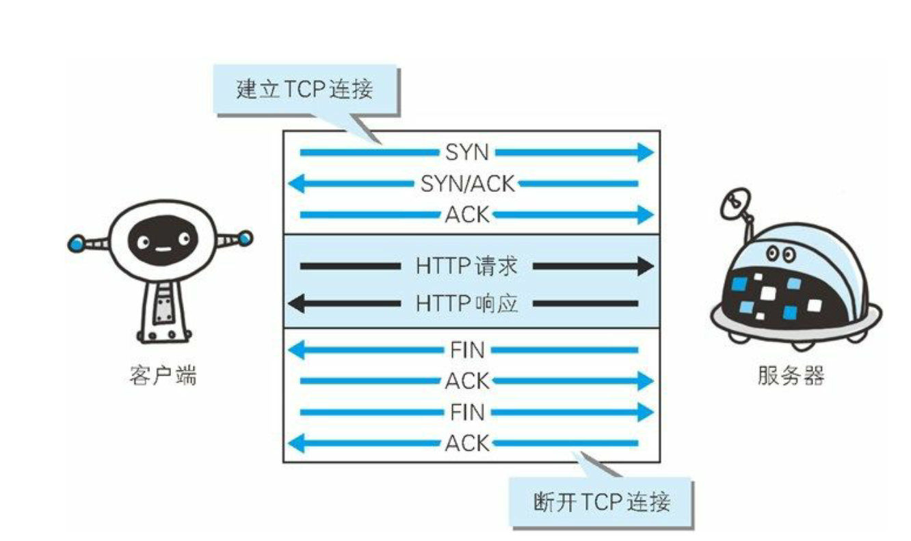
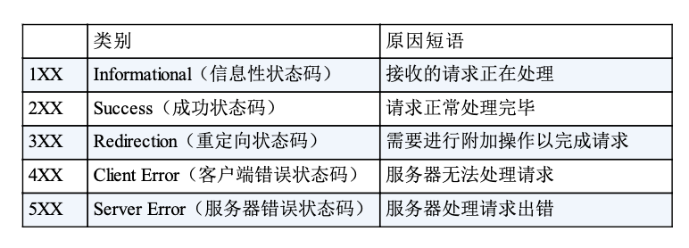
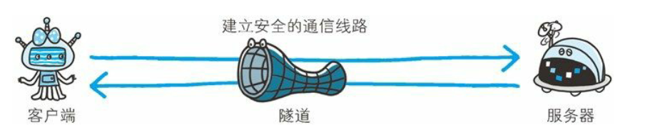

# web 和网络基础

> http namely hyper text transfer protocol

**http 协议知识 tcp/ip 协议的一个子集**

**tcp/ip 分层管理**

- 应用层 http 报文
  应用层决定向用户提供应用服务时通行的活动。
- 传输层 tcp
  传输层对上层应用层，提供处于网络链接中的两台计算机之间的数据传输
- 网络层 ip
  网络层用来处理在网络上的流动的数据包。数据包时网络传输的最小数据单位。该层规定了通过怎样的路径到达对方计算机，并把数据包传送给对方。
- 接口层 以太网
  用来处理链接网络的硬件部分，包括操作系统、硬件等

  

# http: ip\tcp\dns

**负责传输的 ip 协议**
ip: 把各种数据包传送给对方，要确保准确的送给对方需要 IP 地址以及 mac 地址；ip 地址治病了节点被分配到的地址，mac 地址是指所属的固定地址。ip 地址可以和 mac 地址进行配对。Ip 地址可变，但是 mac 地址基本不会改变。

使用 ARP(address resolution protocol)协议凭借 mac 地址进行通信。在网络上，通信的双方在同一局域网的情况很少，通畅经过多台计算机和网络设备中转才能链接到对方，而在进行中转时，会利用下一站的中转设备的 mac 地址来搜索下一个中转目标，arp 是一种用来解析地址的协议，根据通信方的 ip 地址就可以反查出对应的 mac 地址。
没有人能够全面掌握互联网中的传输状况。

**确保可靠性的 TCP 协议**
tcp 属于传输层，提供可靠的字节流服务。
字节流服务就是指将打开数据分割以报文段为单位的数据包进行管理，TCP 协议为了更容易的传送大数据才把数据分割，而且 TCP 协议能够确认数据是否最终送达给对方。
为了准确，TCP 采用了三次握手的策略，
三次握手过程中使用了 TCP 的标志-SYN、ACK

**负责域名解析的 DNS 服务**
应用层协议：提供域名到 IP 地址之间的解析服务

**协议之间的关系**

**URI 和 URL**
URI 是 UNIFORM RESOURCE INDENTIFIER 的缩写。
UNIFORM：规定统一的格式可方便处理不同类型的资源，而不是根据上下文环境来识别资源制定的访问方式
RESOURCE：资源的定义是可标志的任何东西。
IDENTIFIER：表示可标志的对象

URI 格式：

# 简单的 http 协议

请求访问资源的一端称为客户端，提供资源相应的一端就是服务端。

请求报文：
`GET /index.html HTTP/1.1 Host: hackr.jp`
GET：即 method
/index.html 请求访问的资源对象，可以叫做 URI
HTTP/1.1：http 的版本号。
请求报文是由请求方法、请求 URI、协议版本、可选的请求首部字段和内容实体构成的。

响应形式：

**HTTP 是不保存状态的协议**
HTTP 是一种不保存状态的即无状态协议，http 协议自身不对请求和相应之间的通信状态进行保存。http 对与发送的请求和响应都不做持久化处理。

无状态会导致业务处理变得棘手，比如登陆状态的标志，为了实现保持状态的功能引入了 cookie 技术，这样就能管理状态了。
**请求 URI 定位资源**
http 协议使用 uri 定位互联网上的资源，正是因为 uri 的特定功能能在互联网上的任意位置的资源都能被访问到

**告知服务器意图的 http 方法**

- GET：获取资源
  
  
- POST：传输实体主题
  
  
- PUT：传输文件
  HTTP/1.1 的 PUT 方法自身不带验证机制，任何人都可以
  上传文件 , 存在安全性问题，因此一般的 Web 网站不使用该方法。若
  配合 Web 应用程序的验证机制，或架构设计采用
  REST（REpresentational State Transfer，表征状态转移）标准的同类
  Web 网站，就可能会开放使用 PUT 方法
  
- HEAD：获得报文首部
  HEAD 方法和 get 方法一样，知识不返回报文主题，用于去人 URI 的有效性和资源的更新时间
  
- DELETE：删除文件
  
- OPTIONS：询问支持的方法
  
  **持久链接节省通信量**
  
  
  为解决上述 TCP 连接的问题，HTTP/1.1 和一部分的 HTTP/1.0 想出了
  持久连接（HTTP Persistent Connections，也称为 HTTP keep-alive 或
  HTTP connection reuse）的方法。持久连接的特点是，只要任意一端
  没有明确提出断开连接，则保持 TCP 连接状态。

HTTP Keep-Alive 是 HTTP/1.1 中的一项功能，它允许客户端和服务器在同一个 TCP 连接上发送多个请求和响应，而无需为每个请求重新建立连接。这种方式可以减少连接建立和断开的开销，提高性能。

1. **减少连接开销**：避免了频繁的 TCP 三次握手和四次挥手，降低了延迟。
2. **提高性能**：在同一连接中传输多个请求，减少了资源消耗。
3. **节省带宽**：减少了重复的 TCP 头部信息。

尽管 Keep-Alive 有明显的优点，但它的普及受到以下因素的限制：

1. **服务器资源占用**

   - 持久连接会占用服务器的资源（如内存和文件描述符），尤其是在高并发场景下，可能导致服务器资源耗尽。
   - 如果连接保持时间过长，可能会导致其他请求无法及时处理。

2. **连接管理复杂**

   - 需要额外的逻辑来管理连接的生命周期，例如何时关闭空闲连接。
   - 如果客户端不主动关闭连接，服务器需要设置超时时间，这可能导致资源浪费。

3. **HTTP/2 的普及**

   - HTTP/2 和 HTTP/3 已经解决了 HTTP/1.1 的许多问题，例如多路复用（Multiplexing），可以在一个连接中同时传输多个请求和响应。
   - 相比 Keep-Alive，HTTP/2 的性能更高，且更适合现代 Web 应用。

4. **网络环境的限制**

   - 在某些网络环境中，长时间保持连接可能会受到防火墙或代理的干扰，导致连接被意外中断。

5. **客户端和服务器的实现差异**
   - 不同的客户端和服务器对 Keep-Alive 的支持和实现可能存在差异，导致兼容性问题。

HTTP Keep-Alive 是一种有效的优化手段，但由于服务器资源占用、连接管理复杂性以及 HTTP/2 的普及等原因，它并未被广泛使用。在现代 Web 开发中，HTTP/2 和 HTTP/3 已经成为更好的选择，逐渐取代了 HTTP/1.1 的 Keep-Alive 功能。

**使用 Cookie 的状态管理**

- 第一次没有 cookie 信息的请求
  
- 第二次有 cookie 的请求
  

# http 报文内的 http 信息

> http 通信过程包括从客户端发往服务端的请求以及从服务端返回客户端的响应。

**HTTP 报文**
用于 HTTP 协议交互的信息称为 HTTP 报文，请求端就叫请求报文，响应端就叫响应报文

**发送多种数据的多部分对象集合**

- multipart/form-data
  
- multipart/byteranges
  

# 返回结果的 HTTP 状态码

http 状态码负责表示客户端 http 请求返回的结果、标记服务器端的处理是否正常、通知出险的错误等工作。

**2xx 成功**

- 200 ok
  
- 204 no content
  
- 206 partial content
  
  **3xx 重定向**
- 301 move permanently
  
- 302 found
  
- 303 see ohter
  
- 304 not modified
  

**4xx 客户端错误**

- 400 bad request
  
- 401 unauthorized
  
- 403 forbidden
  
- 404 not found
  

**5xx 服务器错误**

- 500 inter server error
  
- 503 service unabailable
  

# 与 http 协作的 web 服务器

**通信数据转发程序：代理、网关、隧道**
代理：
一种具有转发功能的应用程序，他扮演了位于服务器和客户端的中间人的角色，接受由客户端发送的请求并转发给服务器，同时也接受服务器返回的响应并转发给客户端

网关：
网关是转发其他服务器通信数据的服务器，接收从客户端发送来的请求时，他就像拥有自己资源的服务器一样对请求进行处理，有时客户端可能都不会察觉，自己的通信目标是一个网关

隧道：
隧道是在相隔甚远的客户端和服务器两者之间进行中转，并保持双方通信连接的应用程序。

**保存资源的缓存**
缓存是指代理服务器或客户端本地磁盘内保存的资源副本，利用缓存可减少对元服务器的访问，节省了通信时间和流量。
缓存服务器是代理服务器的一种。

# http 首部

**http 通用首部字段**

- cache-control
  
  缓存请求指令
  
  缓存响应指令
  

# 确保 WEB 安全的 HTTPS

- 通信使用明文（不加密），内容可能会被窃听
  
- 不验证通信方的信息，因此有可能遭遇伪装
  
  
- 无法证明报文的完整性，所以有可能篡改
  
  
  **http + 加密 + 认证 + 完整性保护 = https**
  

# 确认访问用户身份的认证

- basic 认证
  

- digest 认证
  
  
  **SSL 客户端认证**
  认证过程
  1. 接受需要认证资源的请求，服务器会发送 certificate request 报文，要求客户端提供客户端证书
  2. 用户选择将发送的客户端证书后，客户端会把客户端证书信息以 client certificate 报文发送给服务器
  3. 服务器验证客户端证书验证通过后方可领取证书内客户端的公开密钥，然后开始 https 加密通信
