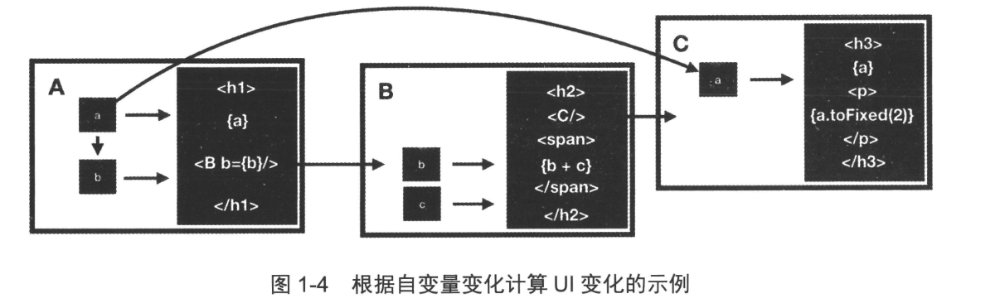
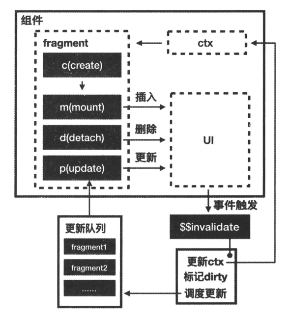
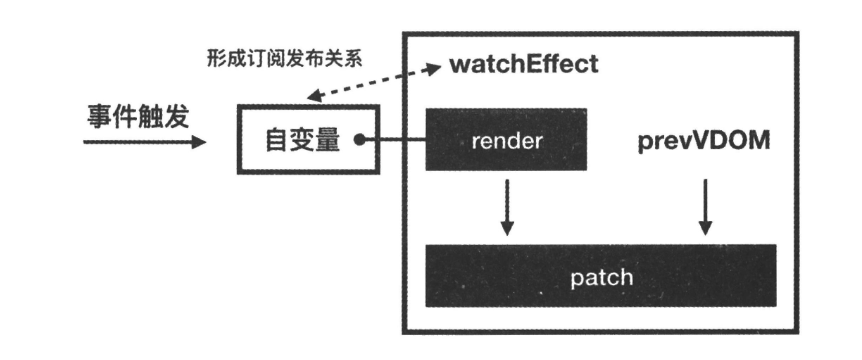
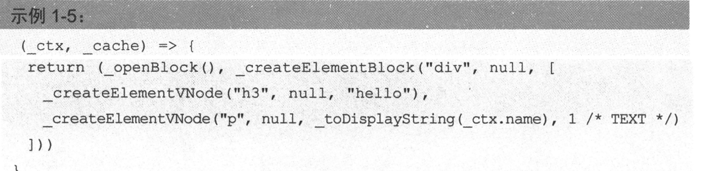
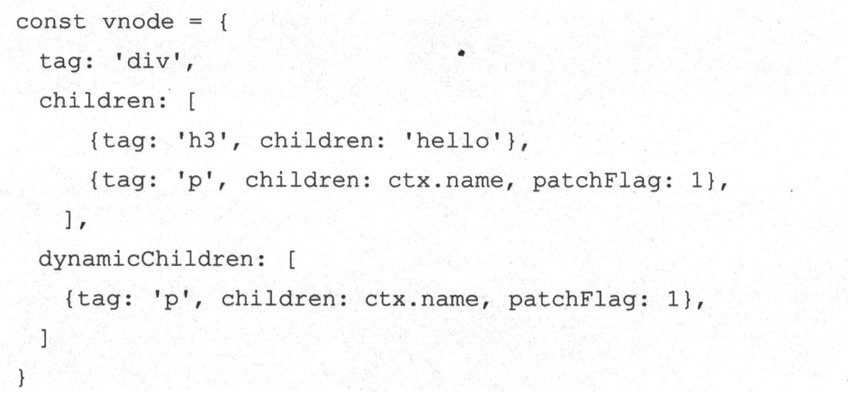

# 1 前端框架原理概览

所有的前端框架都遵循一个架构
$UI = f{state}$即状态驱动 UI
各个框架在架构上差不多，但在这个更新机制实现不相同。可以依据一些标准对其进行分类

- 建立“自变量与元素之间的对应关系”，元素级框架。例如 Slvate
- 建立“自变量与组件之间的关系”，组件级框架。例如 Vue
- 建立“自变量与应用之间的对应关系”，应用级框架。例如 React

  实现不同的对应关系，需要不同的技术路线

- 用于在运行时建立”自变量与因变量的关系“的细粒度更新。
- 用于在编译时建立”自变量与因变量关系“的 AOT
- 用于在运行时实现”根据变量变化计算出 UI 变化的“

  从偏向编译时还是运行时的角度去看框架

- Svelte 是极致的编译时运行框架
- react 是极致的运行时框架
- vue3 同时拥有两者特性，比较均衡
  Q：为什么 React 的性能取决于开发者的理解，而 Vue 普遍性能会好一点呢？
  React 被称为应用级框架的原因在于-其每次更行流程都是从应用的跟节点开始，遍历整个应用对于其他框架
- Vue 的更新流程开始于组件
- Svelte 的更新流程开始于元素
  基于这样的实现原理，React 甚至不需要确定哪个自变量发生了变化。由于任何自变量的变化都会开启一次遍历引用的更新流程，因此 React 不需要细粒度更新和 AOT。
  每次遍历更新应用性能会差吗？不会 react 内部有优化极致，还有 React 为开发者提供了相关 API 用于减少不必要的遍历过程，比如 showComponentUpdate、React.memo、PureComponent。
  为什么 Vue 中不存在这些性能优化的 API 呢？显然组件级别框架的定位和 AOT 已经减少了大部分无意义的遍历过程，可以说由于 React 没有完成这部分的性能优化的任务，因此这部分工作交给了开发者手中。
  这也是为什么 Vue 被比喻为自动挡，而 React 是手动挡。

## 1.1 逻辑和 UI

```
// vue
<h1 v-bind:id="titleId">my name is {{name | lower}}</h>
// react
{ titleId && <h1>my name is{name}</h1>}
```

vue 当中的模版语言他的出发点：既然前端框架使用 html 描述 UI，就扩展 HTML 语法，使它能够描述逻辑，即“从 UI 出发，扩展 UI，描述逻辑”
react 中 jsx 的出发点是，既然前端框架使用 ES 描述逻辑，就扩展 es 语法，是它能够描述 UI，即“从逻辑触发，扩展逻辑，描述 UI”。
两者达到了同样的目的，但会框架的实现产生影响，后续补充//TODO:

## 1.2 如何组织 UI 和逻辑

react hook 采用了初中的知识自变量和因变量

- 定义自变量
  `const [state, setState] = useState()`
- 定义无副作用的因变量（无副作用的因变量 a）
  `const a = useMemo(() => state*2,[state])`
- 有副作用的因变量
  `useEffect(() => document.title = x,[x])`

> 什么叫做副作用
> 这是函数式编程中的概念，函数在执行过重重产生对外部环境的影响。函数满足下面条件可以称“纯函数”

1.  相同的输入始终获得相同的输出
2.  不会修改程序的状态或引起副作用。
    综上 UI 和逻辑的组织方式如下
3.  逻辑中的自变量变化，导致 UI 变化
4.  逻辑中的自变量变化，导致无副作用因变量变化，导致 UI 变化
5.  逻辑中的自变量变化，导致有副作用因变量变化，导致副作用

自变量通过直接间接的方式改变 ui。被改变的 UI 仅仅是对实际宿主环境 UI 的描述，并不是实际宿主环境的 UI。jsx 语句仅仅只是对宿主环境 UI 的描述。需要通过前段框架处理，才能称为宿主环境的真实 UI

只是 hooks 的观点：使用 classcomponent 需要了解各种生命周期的执行时机，甚至不同版本的 react 生命周期执行时机都有所区别。而使用 hooks，仅仅需要要掌握自变量与因变量这一初中数学知识。

## 1.3 前端框架的分类依据

UI = f(state)原理概括为两步

1. 根据自变量(state)变化计算出 UI 变化；
2. 根据 UI 变化执行具体的宿主环境 API


以 vue 组件级别框架为例从”自变量与组件的关系“角度梳理”自变量到 UI 变化“的路径如下：

1. a 变化导致 A 组件的 UI 变化
2. a 变化导致 b 变化，导致 B 的 UI 变化
3. a 变化导致 C 的 UI 变化
4. c 变化导致 B 的 UI 变化

以 react 应用级别框架为例从”自变量与应用的关系“角度梳理”自变量到 UI 变化“路径可以缩减为

1. a 变化导致应用中发生 UI 变化
2. C 变化导致应用中发生 UI 变化

## 1.4 React 中的自变量与因变量

- useState: 定义组件内部的自变量
- useReducer: useState 本质是内置 reducer 的 useReducer。相当于组件内部定义的自变量。
- useContext: React 中 store 的实现，用于跨层级讲其他组件的自变量传递给当前组件。
- useMemo: 采用“缓存的方式”定义组件内部“无副作用因变量”。
- useEffect: 定义组件内部“有副作用的因变量“
- useRef 框架作者在设计组件时需要提供一些灵活度，是开发者在定义 UI 与逻辑时能够跳出组件的限制，执行一些“有副作用的操作”。比如虽然框架接管了 UI 的渲染，但开发者有时希望自行操作 DOM，虽然框架提供了“有副作用因变量”，但如何在过程中执行“有副作用的操作”？这就是 useRef 的用处所在-ref 是 reference 的缩写，用于在组件多次 render 之间缓存一个“引用类型的值”

## 1.5 前端框架使用的技术

```
const effectStack = [];

function subscribe(effect, subs) {
  // 将 effect 添加到 subs 中，并将 subs 添加到 effect 的 deps 中
  // 这样可以在 effect 执行时自动收集依赖项
  // 当状态更新时，通知所有订阅的 effect 执行
  // 这里的 subs 是一个 Set，用于存储所有订阅的 effect
  // 这样可以避免重复订阅同一个 effect
  // 当 effect 执行时，会遍历 subs 中的所有 effect，并执行它们
  // 这样可以实现响应式编程的效果
  // 订阅关系是双向的，effect 可以订阅 subs，subs 也可以订阅 effect
  subs.add(effect);
  effect.deps.add(subs);
}

function clean(effect) {
  // 清理 effect 的依赖项
  // 遍历 effect 的 deps 中的所有 subs，将 effect 从 subs 中删除
  for (const subs of effect.deps) {
    subs.delete(effect);
  }
  // 清空 effect 的 deps
  effect.deps.clear();
}

function useState(value) {
  const subs = new Set();
  const getter = () => {
    const effect = effectStack[effectStack.length - 1];
    if (effect) {
      subscribe(effect, subs);
    }
    return value;
  };
  const setter = (newValue) => {
    value = newValue;
    // 复制subs，如果不复制effect.execute();会修改subs会导致遍历器的内部状态会混乱
    for (const effect of [...subs]) {
      effect.execute();
    }
  };
  return [getter, setter];
}

function useEffect(callback) {
  const effect = {
    execute,
    deps: new Set(),
  };
  const execute = () => {
    // 执行 effect 时，先清理依赖项
    // 这样可以避免重复订阅同一个 effect
    clean(effect);
    // 将 effect 添加到 effectStack 中
    // effectStack 是一个栈，用于存储当前正在执行的 effect
    effectStack.push(effect);
    try {
      // 执行回调函数
      // 在回调函数中可以访问当前状态值，并自动收集依赖项
      callback();
    } finally {
      effectStack.pop();
    }
  };
  // 首次执行时自动收集依赖项
  execute();
}

function useMemo(callback) {
  const [s, set] = useState();
  useEffect(() => {
    set(callback());
  });
  return s;
}

const [state, setState] = useState(0);
const [state2, setState2] = useState(0);
const [showAll,triggerShowAll] = useState(true)
useEffect(() => {
  // 自动收集依赖项
  console.log(state());
});

useEffect(() => {
  // 自动收集依赖项
  console.log(state2());
});

setState(1);
setState2(2);

const whoIsHere = useMemo(() => {
  if(!showAll()) {
    return state()
  }
  return `${state()}和${state1()}`
})

```

通过 getter 方法，获取当前正在执行的 effect`effectStack.push(effect);`，应为`callback()`在 push 之后，所以每次都会获取到该 effect，然后在 getter 方法中去订阅号两者之间的双向依赖`subscribe(effect, subs);`，利用 setter 方法进行发布，通过形成的闭包的 subs 去执行对应的 effect

### 1.5.1 AOT

前端框架都需要编译步骤

1. 将“框架中描述的 UI“转换为宿主环境可识别的代码；
2. 代码转化，将 ts->js 实现 polyfill 等；
3. 执行一些编译时优化
4. 代码打包、压缩、混淆
   编译一般可以在两个时机执行

- 代码构建时，即 AOT(Ahead Of Time： 提前编译或预编译)，宿主环境获得了编译后的代码；
- 代码在宿主环境执行时，称为 JIT(Just In Time，即时编译)，代码在宿主环境中编译并执行；

下面详细说说 **Vue 在 AOT 阶段做了哪些具体优化**：

---

### 1.5.2 Vue AOT 编译做了什么优化？

**模板编译成渲染函数（Render Function）**

- Vue 把模板解析成抽象语法树（AST），再生成高效的 JavaScript 渲染函数。
- 这个渲染函数直接调用 Vue 内部的 `createElementVNode` 等 API，性能更好，且便于后续优化。

---

**静态节点提升（Static Hoisting）**

- 模板中没有依赖响应式数据的部分（纯静态内容，比如固定文本、静态属性、纯标签结构）被提取成 **静态节点**。
- 这些静态节点只渲染一次，后续不参与更新，避免重复创建和比对。
- 减少了运行时的开销。

举例：

```vue
<template>
  <div>
    <h1>固定标题</h1>
    <p>{{ count }}</p>
  </div>
</template>
```

`<h1>固定标题</h1>` 会被提取成静态节点，只渲染一次。

---

**响应式依赖静态分析**

- 编译阶段分析模板里使用的响应式变量（比如 `_ctx.count`）。
- 为每个响应式表达式生成对应的访问代码和依赖收集逻辑。
- 这样，运行时只会监听和重新执行影响当前视图的响应式变量。

---

**精细的动态节点更新**

- 编译器会为动态节点生成 **Patch Flags**，告诉运行时这部分节点具体有哪些类型的动态变化（属性变了？内容变了？事件变了？）。
- 运行时拿到 Patch Flags，只针对变化的部分做更新，跳过不变的节点。

举例：
Patch Flags 可以表示“只有文本内容更新”，所以不需要比对整颗子树，直接更新文本节点即可。

---

5.  **事件处理优化**

- 静态事件绑定的处理也会提升到编译阶段，避免运行时多余的事件绑定和回调重建。

---

6. **模板指令优化**

- `v-if`、`v-for`、`v-show` 等指令会编译成条件判断和循环结构，能在渲染函数里高效执行。
- 比如 `v-if` 只渲染满足条件的节点，减少不必要渲染。

---

#### 总结

| 优化点             | Vue 的做法                                   | 优势                                     |
| ------------------ | -------------------------------------------- | ---------------------------------------- |
| 静态节点提升       | 编译时提取静态部分，渲染时跳过比对           | 减少运行时渲染和 diff 开销               |
| 精细动态节点更新   | 编译生成 Patch Flags 精准标记动态变化        | 只更新变动节点，降低比对范围和频率       |
| 响应式依赖静态分析 | 分析模板中使用的响应式变量，生成依赖收集逻辑 | 运行时只监听必要的状态变化，避免无效触发 |
| 高效事件绑定       | 编译期绑定事件，运行时少量开销               | 减少事件绑定重建                         |
| 优化指令处理       | 编译成高效的条件和循环代码                   | 减少运行时判断，提升渲染效率             |

---

#### 为什么 React 做不到？

React 用 JSX，本质就是执行一个函数，状态和 JSX 之间没有明确的映射关系：

```jsx
function MyComponent() {
  const [count, setCount] = useState(0);
  return <div>{count}</div>;
}
```

- 编译期不能知道 `count` 影响的是哪个具体的 DOM 节点。
- JSX 是 JavaScript 代码片段，依赖于运行时的状态值才能生成结果。
- 只能在运行时执行函数，拿到完整的虚拟 DOM 树后做 diff。
- 只能在运行时决定哪些节点变了，没法提前静态分析优化。

## 1.6 Virtual Dom

> 实现根据自变量变化计算出 UI 变化主流技术

1. 将”元素描述的 UI“转化为“VDOM 描述的 UI”
2. 对比变化前后”VDOM 描述的 UI“，计算出 UI 中发生变化的部分

Vue 中模版语法描述 UI，模板语法编译为 render 函数

1. render 函数执行后返回 Vnode 描述的 UI，这一步骤在 vue 中称为 render
2. 讲变化前后 Vnode 描述的 UI 进行比较，计算出 UI 中变化的部分，这一步骤在 Vue 中称为 patch。

---

> “为什么要用虚拟 DOM？是不是因为框架自己搞了一套 UI 描述，所以才需要它？”

答案大致是 ✅ **是的**。但它**不止是因为 UI 描述语言**，也不完全是因为 “原生 DOM 操作慢”。

---

#### 一、为什么不用原生 DOM？

在框架出现之前，我们是这样操作 DOM 的：

```js
const div = document.createElement("div");
div.innerText = "hello";
document.body.appendChild(div);
```

这样写的代码有几个缺点：

- ✅ **可维护性差**：你每次 DOM 结构变了，就要手动改一堆 create/remove/append。
- ✅ **难以抽象组件**：每次都要重复写。
- ✅ **性能容易踩坑**：频繁操作真实 DOM 会触发 Layout/Style Recalc，代价大。

---

#### 二、那我们能不能写一套“描述 UI 的语言”？

这时候就有了 React 的 JSX、Vue 的模板语法：

```jsx
// React
return <div>Hello {name}</div>

// Vue
<template>
  <div>Hello {{ name }}</div>
</template>
```

这类代码的好处是：

- ✅ 更接近 HTML，易读易写。
- ✅ 更 declarative（声明式），不关心怎么操作 DOM，只关心状态和结构。
- ✅ 更容易维护和组件化。

⚠️ 但**这些模板 / JSX 代码并不是浏览器能识别的**，所以我们需要：

- React 把 JSX 编译成函数（返回虚拟 DOM）
- Vue 把模板编译成渲染函数（返回虚拟 DOM）

这就产生了一个 **“自己的 UI 描述语言”**，你理解得很对 —— 正是这个步骤，导致我们需要“虚拟 DOM”。

---

#### 三、为什么要虚拟 DOM（VDOM）？

有了 UI 描述（JSX / template），我们就得把它变成真实 DOM。

但如果每次 state 一变都直接把整个 `<div>Hello {name}</div>` 全部重新创建 DOM，那性能非常差：

```jsx
return <div>Hello {name}</div>; // 每次 count 变都重建整个 <div>
```

于是：

> ✅ React / Vue 在内存里先“构建”一棵 JS 对象树（虚拟 DOM）
>
> ✅ 每次状态变更时，再次构建新的虚拟 DOM，然后与旧的虚拟 DOM 做 **diff**
>
> ✅ 找出有哪些差异，**只对那些变动的部分做 DOM 更新**（比如只更新文本，不改结构）

这就是虚拟 DOM 存在的意义：**避免每次更新都整体重建 DOM，提高性能 + 保持声明式代码风格**。

---

#### 四、那如果没有“UI 描述语言”，还需要虚拟 DOM 吗？

不一定。

比如 [Svelte](https://svelte.dev) 或 [SolidJS](https://www.solidjs.com) 就没有虚拟 DOM。

它们是怎么做的？

- 编译阶段直接生成对真实 DOM 的操作代码。
- 不用 diff，不用 vDOM。
- 比 Vue/React 还快，因为更新更精准。

比如：

```svelte
<h1>{count}</h1>
```

编译后变成：

```js
const h1 = document.createElement("h1");
h1.textContent = count;
```

并且自动生成：

```js
$: h1.textContent = count;
```

这就叫 **“编译时 DOM 操作”** —— 不需要虚拟 DOM，因为它不需要先描述再比对，它知道谁变了，直接改谁。

---

#### 五、总结

| 框架    | 是否有 UI 描述语言 | 是否用虚拟 DOM | 原因                                              |
| ------- | ------------------ | -------------- | ------------------------------------------------- |
| React   | JSX                | ✅ 是          | 因为 JSX 是函数，返回描述结构，必须比对差异       |
| Vue     | 模板 + 渲染函数    | ✅ 是          | 模板编译成 render 函数，返回描述结构，也需要比对  |
| SolidJS | JSX                | ❌ 否          | 编译期分析依赖，直接生成真实 DOM 更新代码         |
| Svelte  | 模板语法           | ❌ 否          | 编译期生成具体 DOM 操作，不需要描述结构、无需比对 |

---

#### 所以你问的那个话总结一句话：

> **虚拟 DOM 是为了解决“用 JS 描述 UI 结构”而引入的性能优化机制，它不是必须的，但在 JSX / 模板语言中很常见。**

如果你不搞“UI 描述语言”，直接写 DOM 操作（或像 Svelte 一样编译成 DOM 操作），就不需要它了。

以下是 **Virtual DOM（虚拟 DOM）** 的主要优点总结：

1. **性能优化：减少真实 DOM 操作的次数**

   - DOM 是浏览器中最慢的部分，vDOM 允许批量更新并避免频繁读写真实 DOM。

2. **跨平台抽象：可用于 Web、Native、Canvas 等**

   - vDOM 只是一个 JS 对象，易于渲染到不同平台，如 React Native 就是通过 vDOM 渲染到原生组件。

3. **最小差异更新：通过 diff 算法找到变更部分**

   - 不用整体替换 DOM，只更新发生变化的节点，提升效率。

4. **提高开发体验：解耦 UI 描述与实际更新逻辑**

   - 开发者只需关注“状态 → 视图”的描述，不用手动操作 DOM。

5. **便于功能扩展：中间层可以做性能优化、调试等功能**

   - 例如 React 的 Fiber 架构可以进行任务分片和优先级调度。

6. **支持声明式编程：状态驱动视图**

   - 状态一变，vDOM 自动帮你映射出新的 UI，逻辑更清晰易维护。

7. **实现热更新（HMR）和回滚变更更方便**

   - vDOM 是 JS 对象，方便对比、缓存、回滚、调试。

需要详细解释哪一点可以继续问我。

## 1.7 前端框架的实现原理

### 1.7.1 **Svelte**



```
<script lang="ts">
	let count = $state(0);
</script>

<h1>{count}</h1>
<button onclick={() => count++}>
	clicks: {count}
</button>

```

当然可以，以下是 **Svelte 框架原理** 的简明总结，并结合你提供的代码说明其实现机制：

---

#### 🌟Svelte 框架原理（简洁版）：

1. **编译时做响应式绑定（AOT 编译）**

   - Svelte 在构建阶段将模板和逻辑编译成高度优化的 JavaScript，而不是运行时解释。

2. **无虚拟 DOM，直接生成操作真实 DOM 的代码**

   - 不用 vDOM diff，而是精确知道状态和 DOM 的关系，直接生成 `textNode.textContent = count` 这样的原生操作。

3. **自动追踪状态依赖，按需更新**

   - 编译器识别哪些变量是响应式的，一旦变化就只更新相关 DOM。

4. **极简响应式语法，靠编译自动转换**

   - 使用 `$state()`、`$:` 等语法糖，自动生成 setter / updater 逻辑。

---

#### 🔍 示例代码分析：

```ts
<script lang="ts">
	let count = $state(0);
</script>

<h1>{count}</h1>
<button onclick={() => count++}>
	clicks: {count}
</button>
```

#### 编译后大概会变成：

```js
let count = 0;
const h1 = document.createElement("h1");
const button = document.createElement("button");

h1.textContent = count;
button.textContent = `clicks: ${count}`;
button.onclick = () => {
  count += 1;
  h1.textContent = count;
  button.textContent = `clicks: ${count}`;
};
```

---

#### ✅ 总结重点：

- **没有运行时 diff**
- **没有框架 runtime**
- **编译出精准更新代码**
- **语法简洁但功能强大**

非常适合小而快的项目场景。需要我对 `$state()` 的机制做进一步说明也可以。

### 1.7.2 Vue3



```
<script setup>
import {ref} from 'vue'
let count = ref(0)
</script>
<template>
<h1 @click="count++">{{count}}</h1>
</template>
```

**Vue 中 AOT**

```
<div>
<h3>hello</h3>
<p>{{name}}</p>
</div>
```

模版代码对应的 vnode 会在 patch 方法中进行--对比

- div 和 div 比较
- h3 和 h3 比较
- p 和 p 比较

模板发现只有 p 元素是可变的，

第四个穿参是 1，也就是 patchflags，代表 vnode 是可变的
标记 patchFlag 的可变部分单独提取：



当执行 patch 方法时，只需要遍历 dynamicChildren。减少 VDOM 需要对比的节点

### 1.7.4 react


# 2 React 理念

## 2.1 问题与解决思路
