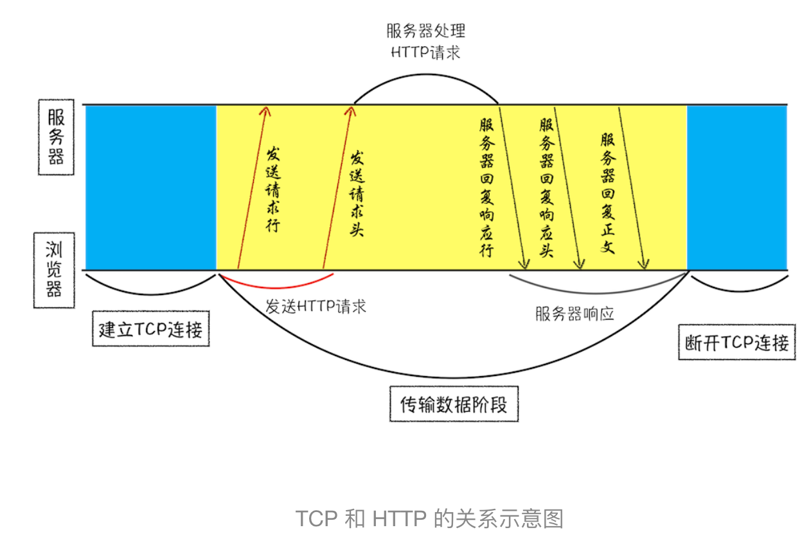
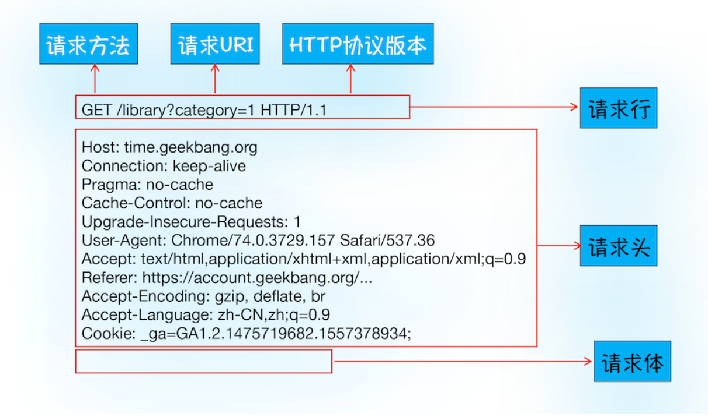
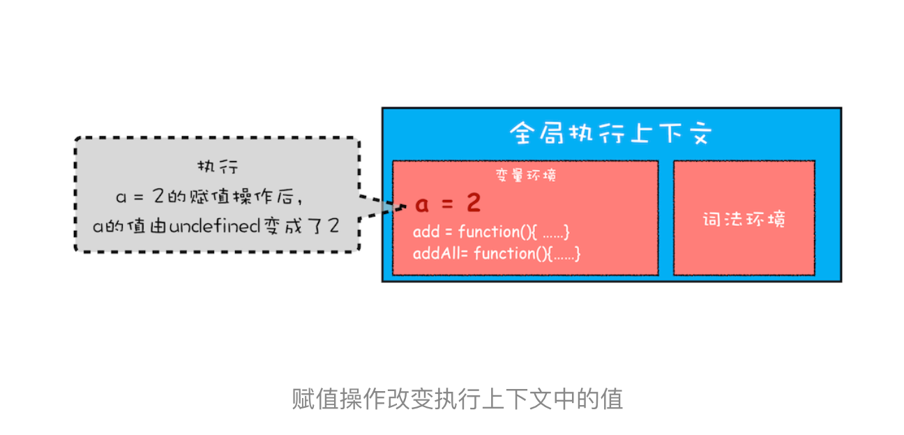
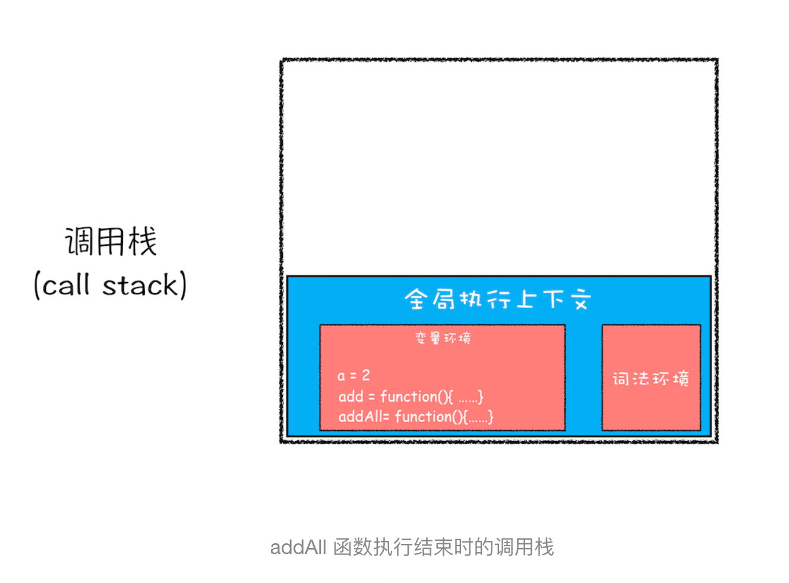
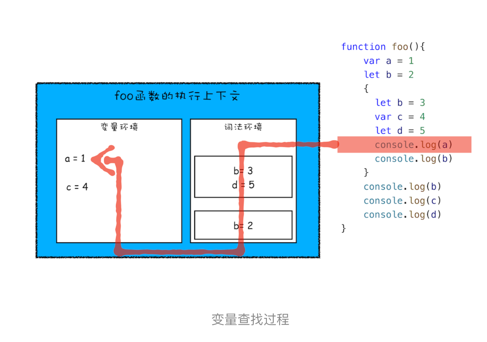
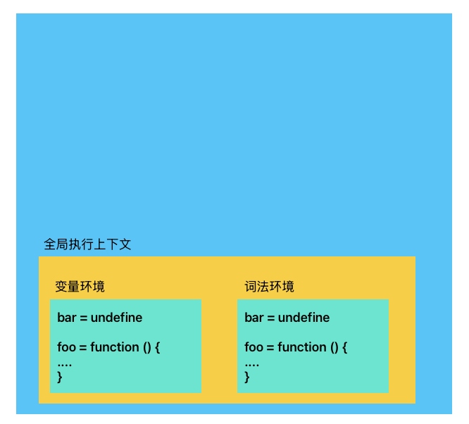
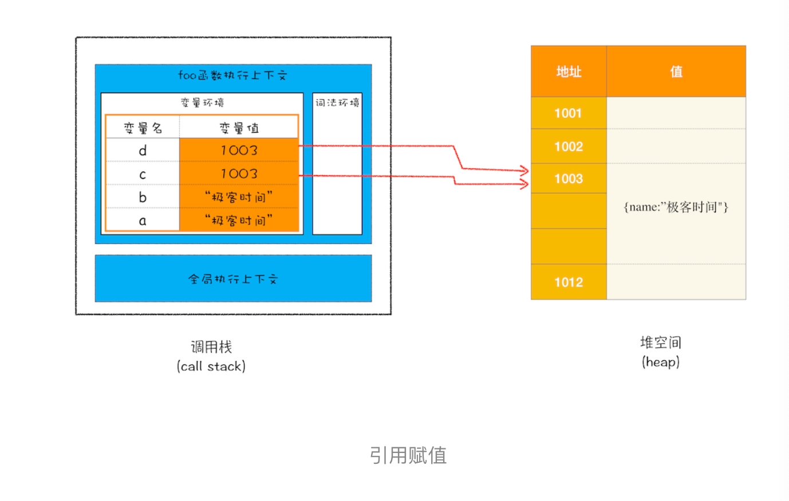
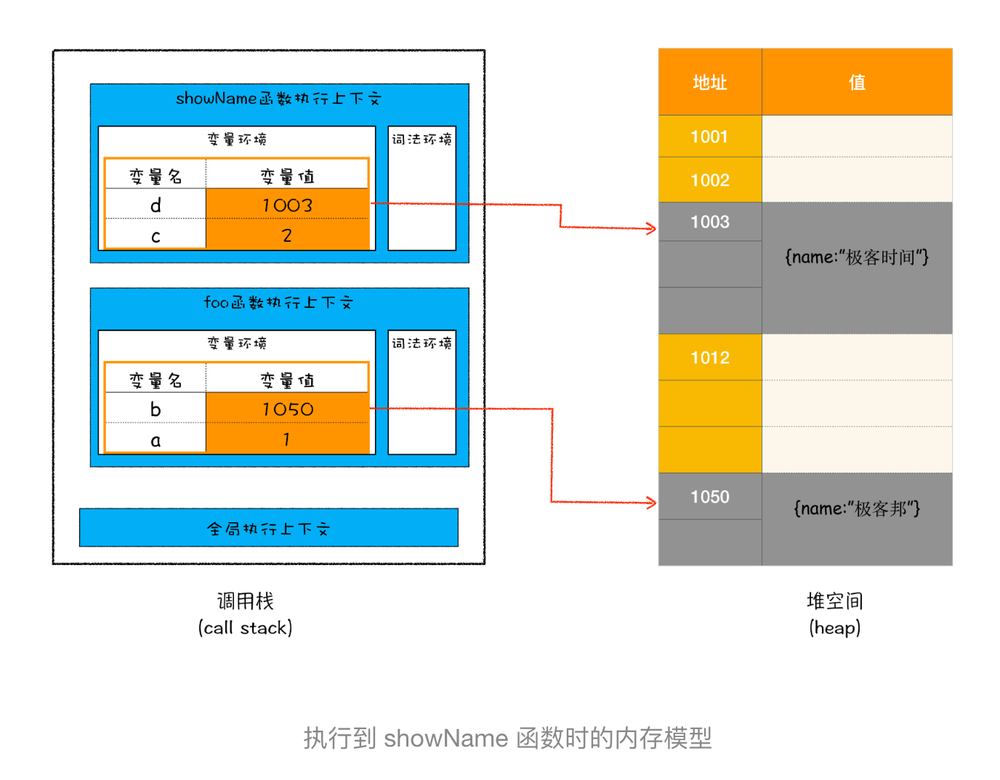
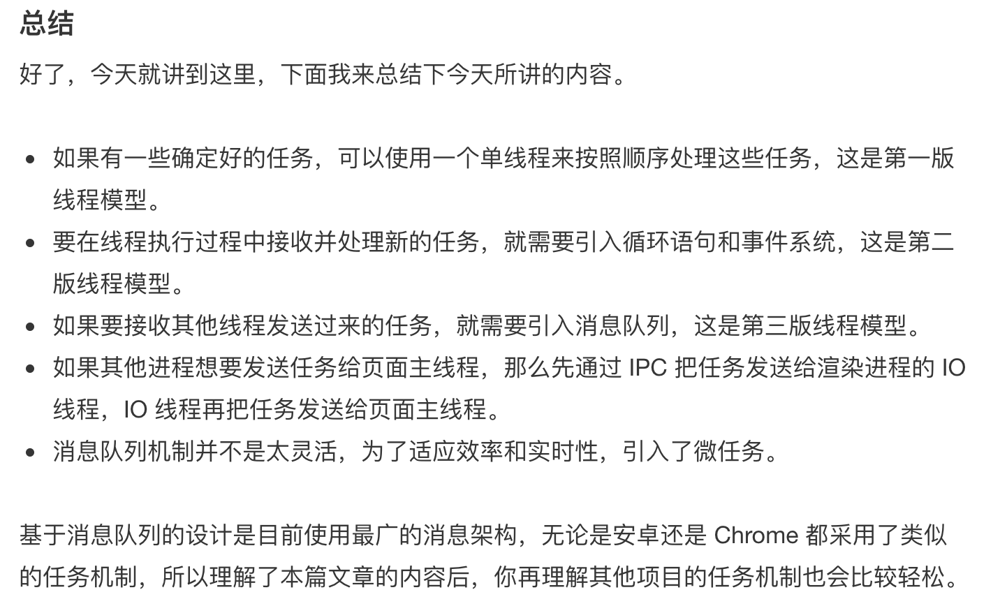

# 浏览器工作原理与实践

来自于[浏览器工作原理与实践](https://blog.poetries.top/browser-working-principle/guide/part1/lesson01.html)

## 宏观视角浏览器

### 仅仅打开一个页面，为什么有多个进程?

**进程：一个进程就是一个程序运行示例，启动一个程序的时候，操作系统会为程序创建一块内存，用来存放代码、运行中的数据和一个执行任务的主线程。**

进程有以下特性：

1. **独立性：** 进程拥有独立的地址空间，一个进程崩溃不会影响其他进程
2. **资源分配单位：** 操作系统以进程为单位分配资源(内存、文件句柄等)
3. **并发性：** 多个进程可以并发执行
4. **动态性：** 进程有创建、执行、暂停、终止等生命周期
5. **结构性：** 进程由程序段、数据段和进程控制块(PCB)组成

**线程：**线程是进程内的一个执行单元，是 CPU 调度和执行的基本单位。一个进程可以包含多个线程，这些线程共享进程的资源。

线程有以下特性：

1. **轻量级：** 创建、切换线程比进程开销小
2. **共享资源：** 同一进程的线程共享内存空间和系统资源
3. **并发执行：** 多线程可并发执行
4. **独立性：** 每个线程有自己的程序计数器、栈和寄存器状态

**什么是并行处理：**
计算机中的并行处理就是同一时刻处理多个任务，单核 CPU 可以通过时间片轮调度算法，操作系统会给每个线程分配一小段 CPU 时间(几毫秒)，让他们交替执行，来实现宏观上“同时运行多个线程的效果”

**线程和进程的关系**

1. 进程中任意线程执行出错，都会导致整个进程的崩溃
2. 线程之间共享进程中的数据
3. 当一个进程关闭之后，操作系统会回收进程中所占用的内存
4. 进程之间的内容相互隔离

**单进程浏览器时代**
单进程浏览器是指浏览器的所有功能模块都运行在同一进程里面，导致浏览器不稳定、不流畅、不安全；

1. **不稳定：** 比如一个插件崩溃整个浏览器奔溃，和之前说的一个线程崩了，整个进程都挂
2. **不流畅：** 页面渲染模块、javascript 执行环境都运行在一个线程中，同一时间只能有一个模块可以执行，导致页面变得卡顿。如果出现无限循环的脚本，其他模块无法执行。
3. **不安全：** 所有的模块都运行在同一个进程里面，如果其中一个模块被攻击，那么整个浏览器都被攻击了。

**多进程浏览器时代**

1. **解决不稳定问题：** 多进程相互之间隔离，一个挂并不影响其他
2. **解决不流畅问题：** 多进程之间可以并行执行，可以同时执行多个模块，比如渲染模块和 javascript 执行环境，这样渲染模块可以渲染页面，javascript 执行环境可以执行脚本，这样页面就不会卡顿，脚本也不会无限循环。
3. **解决不安全问题：** 多进程相互之间隔离并使用安全沙箱，一个被攻击，其他进程不受影响，Chrome 把插件进程和渲染进程锁在沙箱里面，这样即使在渲染进程或者插件进程里面执行了恶意程序，恶意程序也无法突破沙箱去获取系统权限

**目前的多进程架构**


1. 浏览器主进程：负责界面显示、用户交互、子进程管理，提供存储等功能。
2. 渲染进程：核心任务是将 HTML、CSS 和 JavaScript 转换为用户可以与之交互的网页，排版引擎 Blink 和 JavaScript 引擎 V8 都是运行在该进程中，默认情况下，Chrome 会为每个 Tab 标签创建一个渲染进程。出于安全考虑，渲染进程都是运行在沙箱模式下。
3. GPU 进程：、Chrome 的 UI 界面都选择采用 GPU 来绘制，这使得 GPU 成为浏览器普遍的需求。最后，Chrome 在其多进程架构上也引入了 GPU 进程。
4. 网络进程：主要负责页面的网络资源加载，之前是作为一个模块运行在浏览器进程里面的，直至最近才独立出来，成为一个单独的进程
5. 插件进程：主要是负责插件的运行，因插件易崩溃，所以需要通过插件进程来隔离，以保证插件进程崩溃不会对浏览器和页面造成影响。

**多进程的副作用**

- 更高的资源占用，每个进程都要包含基础结构的副本。
- 更复杂的体系架构，浏览器各模块之间融合性高、扩展性差。

**面向服务架构：**


SOA 2016 年已经实现了:
Chrome 面向服务架构（SOA）的核心特点

1. 多进程模型：
   - Chrome 采用多进程架构，每个服务（如渲染、网络、GPU 等）运行在独立的进程中，避免单点故障影响整个浏览器
   - Browser Process（主进程）：管理 UI、插件、扩展等。
   - Renderer Process（渲染进程）：每个标签页一个独立进程。
   - Network Service（网络服务）：独立处理 HTTP 请求。
   - GPU Process（GPU 进程）：负责图形渲染。
   - Storage Service（存储服务）：管理 Cookie、LocalStorage 等。

服务化拆分：
原本的浏览器功能（如音频、扩展、崩溃报告）被重构为独立服务，例如：

- Audio Service（音频服务）
- Extension Service（扩展服务）
- Crashpad Service（崩溃报告服务）。

IPC 通信机制：

- 服务之间通过进程间通信（IPC）进行数据交换，而非直接函数调用，提高安全性和稳定性。

更好的多核 CPU 利用率：

- 由于服务运行在独立进程，Chrome 能更高效地利用多核 CPU，提升性能。


### TCP 协议：如何保证页面文件能被完整送达浏览器

> 在网络中，一个文件通常会拆分为很多数据包来进行传输，而数据包在传输过程中又有很大概率丢失或者出错。如何保证页面文件能被完整送达浏览器呢？

**互联网，实际上是一套里面和协议组成的体系架构。**,协议就是一套众所周知的规则和标准。

1. **IP：把数据包送达目的的主机**

网络协议（internet protocol） IP 标准。计算机的地址称为 IP 地址，任何访问网站实际上只是你的计算机向另一台计算机请求信息。
简化 IP 网络三层传输模型：


- 上层将含有极客时间的数据包交给网络层
- 网络层将 IP 附加到数据包上，组成新的 IP 数据包，交给底层
- 底层通过物理网络将数据包传输给主机 B
- 数据包传输到主机 B 的网络层，拆开数据包的 IP 头信息，将拆开数据交给上层
- 含有信息的数据包达到 B 的上层

2. **UDP：把数据包送达应用程序**

IP 是底层协议，只负责把数据包送达到主机，具体对方电脑并不知道吧数据包给哪个程序，是交给浏览器还是交给王者荣耀？和应用打交道的协议：**用户数据包协议 user datagram protocol** 简称 UDP。
重要信息就是端口号，**IP 通过 IP 地址信息把数据包发送给指定的电脑，而 UDP 通过端口号把数据包分发给正确的程序**。

到此可以在扩充：


- 上层将含有极客时间的数据包交给网络层
- 网络层将 IP 附加到数据包上，组成新的 IP 数据包，交给底层
- 底层通过物理网络将数据包传输给主机 B
- 数据包传输到主机 B 的网络层，拆开数据包的 IP 头信息，将拆开数据交给传输层
- 传输层将数据包中的 UDP 头拆开，更具 UDP 中提供的端口号，把数据部分交给上层应用程序
- 最终应用程序拿到数据，进行解析。

**UDP 不能保证数据可靠性，但是传输速度非常快，UDP 不提供重发机制，只是丢弃当前包，而且 UDP 在发送之后无法知道是否到达目的地**

3. **TCP：保证数据包能被完整送达**
   因为 UDP 的问题，浏览器请求如果使用 UDP：
4. 数据包在传输过程中容易丢失
5. 大文件会拆分小的数据包传输，小数据包会经过不同的路由，并不不同的时间达到接收端，UDP 协议不知道如何组装这些数据包，无法还原成完成的文件.

**TCP 协议**: TCP(Transmission Control Protocol)传输控制协议，面向连接的、可靠的、基于字节流的传输层通讯协议。

1. 对于数据包丢失 TCP 提供重传机制。
2. TCP 引入数据包排序机制，用来保证乱序的数据包组合成一个完整的文件


**TCP 单个数据包的传输流程和 UDP 差不多，但是 TCP 头的信息保证了一块达的数据传输完整性**

**TCP 的完整连接过程**


1. 建立连接：三次握手建立客户端和服务器之间的连接，TCP 提供面向连接的通信传输。面向连接是指数据通行开始之前先做好两端之间的准备工作，三次握手，是指在建立一个 TCP 连接时，客户端和服务器总共要发送三个数据包以确认连接的建立。
2. 传输数据阶段：接收端要对每个数据包进行确认操作，也就是接收端在接收到数据包之后，需要发送确认数据包给发送端。所以当发送端发送一个数据包之后，在规定时间内没有接收到接收端反馈的确认信息，则判断为数据包丢失，并触发发送端的重发机制。同样，一个达的文件在传输过程中会被拆分成很多小的数据包，这些数据包达到接收端后，接收端会按照 TCP 头的需要为其排序，从而保证组成完整的数据。
3. 断开连接阶段：数据传输完毕之后，就要终止连接了，涉及到最后一个阶段四次回收来保证双方都能断开连接。

> TCP（传输控制协议）是一种面向连接的可靠传输协议，其连接管理通过**三次握手建立连接**和**四次挥手释放连接**实现。以下是详细流程和关键细节：

---

### **一、三次握手（建立连接）**

**目标**：同步双方的初始序列号（ISN），确认双方收发能力正常。**流程**：

1. **SYN（客户端 → 服务器）**

   - 客户端发送`SYN=1`（同步标志位），随机生成初始序列号`seq=x`（ISN）。
   - 进入`SYN_SENT`状态。
   - **关键点**：不携带应用层数据，仅占用一个序列号。

2. **SYN-ACK（服务器 → 客户端）**

   - 服务器回复`SYN=1`和`ACK=1`，确认号`ack=x+1`，同时发送自己的初始序列号`seq=y`。
   - 进入`SYN_RCVD`状态。
   - **关键点**：`ACK`是对客户端`SYN`的确认，`SYN`是服务器自身的同步请求。

3. **ACK（客户端 → 服务器）**

   - 客户端发送`ACK=1`，确认号`ack=y+1`，序列号`seq=x+1`（初始序列号+1）。
   - 双方进入`ESTABLISHED`状态，连接建立。
   - **关键点**：此报文可携带应用层数据（如 HTTP 请求）。

**为什么需要三次？**

- 防止历史重复连接初始化导致的资源浪费（两次无法确认客户端接收能力）。
- 确保双方收发能力正常（双向确认）。

---

**二、四次挥手（释放连接）**
**目标**：双方独立关闭数据通道，确保数据完整传输。**流程**：

1. **FIN（主动方 → 被动方）**

   - 主动方（如客户端）发送`FIN=1`，序列号`seq=u`（已传输数据的最后一个字节+1）。
   - 进入`FIN_WAIT_1`状态，停止发送应用层数据。

2. **ACK（被动方 → 主动方）**

   - 被动方回复`ACK=1`，确认号`ack=u+1`，序列号`seq=v`。
   - 进入`CLOSE_WAIT`状态，仍可发送未传输完的数据。
   - 主动方收到后进入`FIN_WAIT_2`状态。

3. **FIN（被动方 → 主动方）**

   - 被动方数据发送完毕后，发送`FIN=1`和`ACK=1`，序列号`seq=w`，确认号`ack=u+1`（与步骤 2 相同）。
   - 进入`LAST_ACK`状态。

4. **ACK（主动方 → 被动方）**

   - 主动方回复`ACK=1`，确认号`ack=w+1`，序列号`seq=u+1`。
   - 进入`TIME_WAIT`状态（等待`2MSL`，确保最后一个 ACK 到达被动方）。
   - 被动方收到后立即关闭连接，主动方超时后关闭。

**为什么需要四次？**

- TCP 是全双工的，必须分别关闭两个方向的数据流。
- 被动方可能需要时间处理剩余数据（延迟确认`ACK`和`FIN`分开发送）。

---

**三、关键细节与问题**

1. **序列号（ISN）随机化**

   - 防止历史报文被误认为有效连接（安全考虑）。

2. **TIME_WAIT 状态（2MSL）**

   - 确保最后一个`ACK`到达被动方（重传被动方的`FIN`）。
   - 让网络中残留的旧连接报文失效（MSL=报文最大生存时间，通常 30 秒-2 分钟）。

3. **半关闭状态**

   - 一方发送`FIN`后仍可接收数据（如服务器在`CLOSE_WAIT`状态）。

4. **SYN Flood 攻击**

   - 攻击者伪造大量`SYN`但不完成握手，耗尽服务器资源。防御方法：SYN Cookie、限制并发连接数。

---

**四、示意图**

```
三次握手：
C → S: SYN=1, seq=x
S → C: SYN=1, ACK=1, seq=y, ack=x+1
C → S: ACK=1, seq=x+1, ack=y+1

四次挥手：
C → S: FIN=1, seq=u
S → C: ACK=1, ack=u+1
S → C: FIN=1, ACK=1, seq=w, ack=u+1
C → S: ACK=1, ack=w+1
```

通过以上流程，TCP 实现了可靠连接的建立和释放，确保数据传输的有序性和完整性。

### http 请求：为什么很多站点第二次访问速度会更快？

HTTP：建立在 TCP 连接基础上。HTTP 是一种允许浏览器向服务器获取资源的协议，是 Web 的基础。通常由浏览器发起请求，用来获取不同类型的文件，例如 HTML、CSS、JavaScript、图片、音频、视频等。HTTP 是浏览器使用最广的协议。
两个问题：

1. 为什么第二次访问速度会更快？
2. 为什么能够保存登录状态？

**浏览器发起 HTTP 请求：**

比如随便访问一个页面
**1. 构建请求**

```
GET /index.html HTTP1.1
```

**2. 查找缓存**

浏览器缓存是一种在本地保存资源副本，以供下次请求时直接使用的技术。

**3. 准备 IP 地址和端口**

HTTP 协议是应用层协议，用来封装请求的文本信息，并使用 TCP/IP 作为传输层协议将它发到网络上。HTTP 的内容是通过 TCP 的传输数据阶段来实现的。


- http 网络请求第一步和服务器建立 TCP 连接
- 通过 URL 地址准备 IP 地址和端口号

IP 映射域名：**域名系统**DNS(domain name system)

所以第一个步会请求 DNS 返回域名对应的 IP，并且浏览器会缓存 DNS 数据。

**4. 等待 TCP 队列**

Chrome 有个机制，同一个域名同时最多只能建立 6 个 TCP 连接，如果在同一个域名下同时有 10 个请求发生，那么其中 4 个请求会进入排队等待状态，直至进行中的请求完成。
当前 chrome 优化了该机制，只要浏览器和服务器都支持 HTTP/2/3，通常同一域名只会建立 1 个连接，所有请求都复用这一个连接，不再受 6 个连接的限制

**5. 建立 TCP 连接**

排队等待结束后，就可以和服务器握手了。

**6. 发送 HTTP 请求**
建立了 TCP 连接，浏览器就可以和服务器进行通信了，http 中的数据就是在通信过程中传输的。



浏览器发送请求行，包括请方法，请求 URI(uniform resource identifier)和 HTTP 版本协议
在浏览器发送请求命令之后，还要以请求头形式发送其他一些信息包含操作系统内核等等。

**服务器端处理 HTTP 请求**

**1. 返回请求**


首先服务器会返回响应行，包括协议版本和状态码
不是所有的请求服务器都能处理，服务器会通过请求行的状态码来告诉浏览器的处理结果

- 200 OK：请求成功，服务器已经收到请求，并成功处理了请求。
- 404 Not Found：请求的资源不存在，服务器找不到对应的资源。

服务器给浏览器发送响应头，响应头包含服务器自身的一些信息，数据类型等等。发送完响应头，就能继续发送响应体数据。响应体包含 html 的实际内容

**2. 断开连接**

一般情况，服务器向客户端返回了请求数据，就会关闭 TCP 连接。
`Connection:Keep-Alive`
保持 TCP 连接可以省去下次请求时需要建立连接的时间，提升资源加载速度。

**3. 重定向**

301 重定向


解答了：

1. 为什么第二次打开速度会很快

   DNS 缓存，页面缓存。
   
   当服务器返回 HTTP 响应头给浏览器时，浏览器是通过响应头中的 Cache-Control 字段来设置是否缓存该资源。

2. 登录状态如何保持？

setCookie


### 导航流程：从输入 URL 到页面展示，这中间发生了什么？

经典面试题：浏览器从输入 URL 到页面展示，这中间发生了什么？


**回顾下职责：**

- 浏览器进程：负责用户交互、子进程管理、文件储存等。
- 网络进程：面向渲染进程和浏览器进程等提供网络下载功能
- 渲染进程：网络下载的 html、javascript、css 等资源解析为可以显示和交互的页面。会存在一些恶意代码利用浏览器漏洞对系统进行攻击，所以渲染进程运行在安全沙箱里。

**详细的流程：**

1. 浏览器进程接收到用户输入的 url 请求，浏览器将 url 转发给网络进程
2. 网络进程真正发起 url 请求
3. 网络进程收到了响应头数据，解析数据，并讲数据转发给浏览器进程
4. 浏览器进程接网络进程响应数据，发送提交导航消息给到渲染进程
5. 渲染进程收到提交导航的消息，开始准备接收 html 数据，接收数据的方式是直接和网络进程建立数据管道
6. 最后渲染进程想浏览器进程确认提交，告诉浏览器进程：已经准备接受和解析页面数据
7. 浏览器进程及收到渲染进程提交文档的消息之后，移除之前旧的文档，然后更新浏览器进程中的页面状态

**URL 到页面开始解析的整个过程就叫做导航**

**从输入 URL 到页面展示**

**1. 用户输入**
地址栏判断输入的关键字是搜索内容还是请求的 url

- 如果是搜索内容浏览器使用浏览器默认的搜索引擎
- 如果符合 url 规则，地址栏会更具规给这段内容加上协议，合成完整的 url

回车后当前页面即将替换成新的页面，在这个流程继续之前，浏览器还给当前页面一次执行 beforeunload 事件的机会，比如数据清理操作，可以询问页面是否要离开当前页面，如果没有 beforeload 则进入后续流程

**2. URL 请求过程**
浏览器进程会通过进程间通信 IPC 吧 url 请求发送给网络进程，网络进程发送正真的 URL 请求网络进程先查是否有缓存，如果有，则直接返回资源，如果没有进入网络请求流程。

- DNS 解析，获取请求域名服务器 IP 地址如果 HTTPS，还要建立 TLS 连接
- 利用 IP 地址和服务器建立 TCP 连接。建立后浏览器会构建请求行、请求头等信息、并把该域名的 cookie 等数据附加到请求头中，让后向服务器发送构建的请求信息

  **2.1 重定向**
  接收到服务器返回的响应头，网络进程解析响应头，如果状态 301 或者 302，服务器需要浏览器重定向到其他 URL。读取重定向的地址，发起新的 http 或者 https 请求，重新进入步骤 2
  

  **2.2 响应数据类型处理**
  URL 请求的数据类型，有时候是一个下载类型，有的时候是一个正常的 html 界面，浏览器如何区分它？
  Content-Type，**Content-Type 是 HTTP 头中一个非常重要的字段， 它告诉浏览器服务器返回的响应体数据是什么类型，**，然后浏览器会根据 Content-Type 是 HTTP 头中一个非常重要的字段， 它告诉浏览器服务器返回的响应体数据是什么类型，
  
  
  如果 ContentType 字段被浏览器判断为是下载类型，那么该请求会被提交给浏览器的下载管理器，同时该 URL 请求的挡寒流程就此结束，如果是 html 那么浏览器则继续进行导航流程

**3. 准备渲染进程**
默认情况下，chrome 会为每一个页面分配一个渲染进程，在某些情况下，浏览器会让多个页面直接运行在同一个渲染进程中。

总得来说渲染进程策略：

- 通常情况新页面会使用单独的渲染进程
- 如果从 A 页面打开 B 页面，如果 AB 都属于统一站点的话，那 B 页面复用 A 的渲染进程
  渲染进程准备好之后，还不能立即进入文档解析状态，此时文档数据还在网络进程，没有提交给渲染进程。

**4. 提交文档**
将网络进程结束到的 html 数据交给渲染进程

1. 浏览器接收到网络进程的响应头数据之后，便向渲染进程发起提交文档的消息
2. 渲染进程接收到提交文档信息，会立即和网络进程建立传输数据的"管道"
3. 等文档传输完成之后，渲染进程会返回确认提交的信息给浏览器进程
4. 浏览器进程收到确认提交之后，会更新浏览器界面状态，包括安装状态，地址栏 URL，前进后退的历史状态，更新 web 页面
   

**5. 渲染页面**

一但页面生成完成，渲染进程会发送一个信息给浏览器进程，收到消息后会停止标签图标上的加载动画。

### 渲染流程（上）：HTML、CSS 和 JavaScript，是如何变成页面的？


**1. 构建 dom 树**
浏览器无法直接理解和使用 HTML,需要将 html 转换为浏览器能够理解的结构--DOM 树


**2. 样式计算**
**- 把 css 转换为浏览器能够理解的结构**
css 的来源主要有三种：
通过 link 应用的外部 css 文件
style 标记内的 css
元素 style 属性内嵌的 css

css 无法理解纯文本的 css 样式，所以当渲染引擎接收到 css 文件是，会执行转换操作，将 css 文本转转化为浏览器可以理解的结构--stylesheets

**- 转换样式表中的属性值，使其标准化**


**- 计算出 DOM 树中每一个节点的具体样式**
css 继承就是每个 dom 节点都包含有父节点的样式


**3. 布局阶段**
计算 DOM 树中课件元素的几何位置，这个过程叫做布局
**创建布局树**

**布局计算**
计算节点的坐标位置

### 渲染流程（下）：HTML、CSS 和 JavaScript，是如何变成页面的？

回顾以下：在 HTML 页面内容被提交给渲染引擎之后，渲染引擎首先将 HTML 解析为浏览器可以理解的 DOM；然后根据 CSS 样式表，计算出 DOM 树所有节点的样式；接着又计算每个元素的几何坐标位置，并将这些信息保存在布局树中。

#### 分层

有了布局树，元素具体位置计算了出来，那么接下来是不是就要开始着手绘制页面了？
**no，渲染引擎还需要为特定的节点生成专用的图层，并生成一颗对应的图层树。**
图层可以在浏览器中 layers 标签就能看到。
**浏览器页面实际被分成了很多图层，这些图层叠加后合成了最终的页面。**

通常情况下，并不是布局树的每一个节点都包含一个图层，如果一个节点没有对应的层，那么这个节点就从属于父节点的图层。
**1. 拥有层叠上下文属性的元素会被提升为单独的一层。**

**2. 需要裁剪的地方也会被创建为图层**

#### 图层绘制

渲染引擎实现图层的绘制与之类似，会把一个图层的绘制分为很多小的绘制指令，然后再把这些指令按照顺序组成一个待绘制列表：


#### 栅格化操作

合成线程会将图层划分为图块（tile），这些图块的大小通常是 256x256 或者 512x512，如下图所示：


栅格化，是指将图块转换为位图，而图块是栅格化执行的最小单位。渲染进程维护了一个栅格化的线程池，所有的图块栅格化都是在线程池内执行的，运行方式如下图所示：


#### 合成和显示

一旦所有图块都被光栅化，合成线程就会生成一个绘制图块的命令——“DrawQuad”，然后将该命令提交给浏览器进程。 浏览器进程里面有一个叫 viz 的组件，用来接收合成线程发过来的 DrawQuad 命令，然后根据 DrawQuad 命令，将其页面内容绘制到内存中，最后再将内存显示在屏幕上。

#### 渲染流水线大总结

1. 渲染进程将 HTML 内容转换为能读懂的 DOM 树结构
2. 渲染引擎将 CSS 样式表转化为浏览器可以理解的 stylesheets，计算出 dom 节点的样式
3. 创建布局树，并计算元素的布局信息
4. 对布局树进行分层，生成分层树
5. 为每个图层生成绘制列表（绘制指令），并将其提交给合成线程
   
6. 合成线程将图层分成图块，并在光栅化线程池中将图快转换为位图
7. 合成线程发送绘制图块命令 DrawQuad 给浏览器进程
8. 浏览器进程更具 DrawQuad 消息生成页面，并显示到显示器上

## 浏览器中的 JAVASCRIPT 执行机制

### 变量提升：javascript 代码是按顺序执行的吗？

**只有理解了 javascript 的执行上下文，才能更好理解 javascript 语言本身**，变量提升、作用域、闭包。

#### 变量提升

```javascript
var myname = "jikeshijian";
// 等价于
var myname = undefined;
myname = "jikeshijian";
```


```javascript
function foo() {
  console.log("foo");
}
var bar = function () {
  console.log("bar");
};
```

这两个函数是不一样的，foo 是一个完整的函数声明，没有涉及赋值操作，第二个函数是先声明 bar 变量，再把`function(){console.log('bar')}`赋值给 bar。


**变量提示：值 javascript 代码执行过程中，javascript 引擎把变量的声明部分和函数的声明部分提升到了代码开头的行为。变量被提升后，会给变量设置默认值，这个默认值就是 undefine**

**总结：变量提升的意义**

- 历史遗留：最初的设计为了简化实现和灵活性。
- 函数优先：函数提升对代码组织更友好。
- 作用域统一：确保变量属于整个作用域，而非“顺序执行”。
- 现代替代方案：通过 let/const 规避问题，同时保持兼容性。

**变量和函数声明在代码里的位置是不会改变的，而是在编译节点被 javascript 疫情放到了内存之中**，一段 javascript 代码在执行之前需要被 javascript 引擎编译，编译完成之后，才会进入执行阶段。


**1. 编译阶段**
**第一部分：变量提升部分的代码**

```javascript
var myname = undefined;
function showname() {
  conosle.log("函数showname被执行");
}
```

**第二部分：执行部分的代码**

```javascript
showname();
console.log(myname);
myname = "jikeshijian";
```


图中可以看到，代码经过编译之后会生成两部分内容：**执行上下文(execution context)和可执行代码**
**执行上下文是 javascript 执行一段代码时的运行环境** 比如调用一个函数，就会进入这个函数的执行上下文，确定该函数在执行期间用到的诸如 this、变量、对象以及函数等。也就是在执行上下文中存在一个**变量环境的对象(virible environment)**该对象保存了变量提升的内容，比如上面代码的变量和函数。
可以把他看做如下这个

```javascript
VariableEnvironment:
     myname -> undefined,
     showName ->function : {console.log(myname)}
```

**2. 执行阶段**

1. 执行到 showname 函数时，javascript 引擎便在变量环境对象中查找该函数
2. 接下来打印 myname 信息，javascript 引擎继续在变量环境对象中查找该对象。
3. 把 jikeshijian 复制给 myname，赋值后变量环境中的 myname 属性改变为 jikeshijian

let 和 const 虽然没有变量提升，在编译阶段其实也会放到执行上下文的变量环境中，但不会被初始化，而是处于“暂时性死区（TDZ, Temporal Dead Zone）”，如果执行过程中访问这个变量，就会报错。

### 调用栈：为什么 javascript 代码会出现栈溢出？

前面说到，当一段代码被执行时，javascript 引擎会对其进行编译，并创建执行上下文。
那些情况下代码才算是“一段”代码，才会在执行之前就进行编译并创建执行上下文?

1. 当 javascript 执行全局代码时，会编译全局代码并创建全局执行上下文，而且在这个页面的生命周期内，全局执行上下文只有一份
2. 当调用一个函数的时候，函数体内的代码会被编译，并创建函数执行时上下文，一般情况下，函数执行执行结束之后，创建的函数执行上下文被销毁。（闭包不会）
3. 当时用 eval 函数的时候，eval 代码也会被编译，并创建执行上下文。


调用栈：在 javascript 中有很多函数，经常会出现在一个函数中调用另外一个函数的情况，**调用栈就是用来管理函数调用关系的一种数据结构**

```javascript
var a = 2;
function add() {
  var b = 10;
  return a + b;
}
add();
```


在这个执行过程中我们其实会有两个执行上下文，一个全局执行上下文，一个 add 函数执行上下文。
那 javascript 引擎如何管理这些执行上下文呢？
**通过一种叫栈的数据结构来管理的**


**什么是 javascript 的调用栈**
javascript 引擎利用栈的数据结构来管理执行上下文的，在执行上下文创建好后，JavaScript 引擎会把执行上下文压入栈中，通常把这种用来管理执行上下文的栈称为**执行上下文栈**，又称为**调用栈**

```javascript
var a = 2;
function add(b, c) {
  return b + c;
}
function addAll(b, c) {
  var d = 10;
  result = add(b, c);
  return a + result + d;
}
addAll(3, 6);
```

例如上面代码他的调用栈的状态变化情况。
**1. 创建全局上下文，并将其压入栈底**

全局执行上下文压入到调用栈后，javascript 开支执行全局代码了。首先执行 a=2 的赋值函数，执行语句会将全局上下文环境变量中的 a 设置为 2.

**2. 调用 addall 函数。**
当调用该函数时，javascript 引擎会编译该函数并为其创建一个执行上下文，最后还讲该函数的执行上下文压入栈中：

**3. 当执行到 add 调用语句时**
同样会围棋创建执行上下文，并将其压入调用栈

当 add 函数返回时函数执行的上下文就会从栈顶弹出，并将 result 的值设置为 add 函数的返回值：

addall 执行最后一个相加操作后返回，addall 的执行上下文也会从栈顶弹出，此时调用栈中就只剩下全局上下文了。

至此，整个 javascript 流程执行结束。
**调用栈是 javascript 引擎追踪函数执行的机制**

### 在开发中，如何利用好调用栈


栈的最底部是的 anonymous，也就是全局函数入口，中间的是 addall 函数；顶部是 add 函数。在**分析复杂结构代码，检查 bug 时，调用栈都是非常有用的。**

### 栈溢出

**调用栈是有大小的，当入站的执行上下文超过一定数量，javascript 就会报错，这种错误就叫做栈溢出**

```javascript
function division(a, b) {
  return division(a, b);
}
console.log(division(1, 2));
```

递归函数，没有终止条件，就会一直创建函数执行上下文，并反复压入栈中，最后栈溢出

### 块级作用域：var 缺陷以及为什么要引入 let 和 const？

**javascript 存在变量提升，正是由于 JavaScript 存在变量提升这种特性，从而导致了很多与直觉不符的代码，这也是 JavaScript 的一个重要设计缺陷。**

#### 作用域

**作用域是指在程序中定义变量的区域，该位置决定了变量的生命周期。通俗地理解，作用域就是变量与函数的可访问范围，即作用域控制着变量和函数的可见性和生命周期。**
ES6 之前函数就存在两种作用域：

1. 全局作用域
2. 函数作用域

ES6 之前并不存在快作用域，没有块作用域会导致很多问题？

**1. 变量容易在不被察觉的情况下被覆盖掉**

```javascript
var myname = "极客时间";
function showName() {
  console.log(myname);
  if (0) {
    var myname = "极客邦";
  }
  console.log(myname);
}
showName();
```

**2. 本应销毁的变量没有被销毁**

```javascript
function foo() {
  for (var i = 0; i < 7; i++) {}
  console.log(i);
}
foo();
```

### ES6 是如何解决变量提升带来的缺陷

**ES6 引入了 let 和 const 关键字**

### JavaScript 是如何支持块级作用域的

```javascript
function foo() {
  var a = 1;
  let b = 2;
  {
    let b = 3;
    var c = 4;
    let d = 5;
    console.log(a);
    console.log(b);
  }
  console.log(b);
  console.log(c);
  console.log(d);
}
foo();
```

**第一步是编译并创建执行上下文**


- 函数内部通过 var 声明的变量，在编译阶段全都存在了**变量环境**里面了
- 通过 let 声明的变量，在编译就会存放到**词法环境(lexical environment)**中
- 在函数的作用域快内部，通过 let 声明的变量并没有存放到词法环境中。

**第二部继续执行代码**

当进入函数的作用域块时，作用域中通过 let 声明的变量，会被存放在词法环境的一个单独的区域中。这个区域的变量并不影响作用域块外面的变量，比如在作用域外面声明了变量 b 在该作用域内部也声明了变量 b，当执行到作用域内部时，他们都是独立的存在。
在词法环境内部，维护了一个小型栈结构。

**变量查找的过程**

块级作用域就是通过词法环境的栈结构来实现的。

#### 思考时间

```javascript
let myname = "极客时间";
{
  console.log(myname);
  let myname = "极客邦";
}
```

【最终打印结果】：VM6277:3 Uncaught ReferenceError: Cannot access 'myname' before initialization
【分析原因】：在块作用域内，let 声明的变量被提升，但变量只是创建被提升，初始化并没有被提升，在初始化之前使用变量，就会形成一个暂时性死区。
【拓展】
var 的创建和初始化被提升，赋值不会被提升。
let 的创建被提升，初始化和赋值不会被提升。
function 的创建、初始化和赋值均会被提升。

### 作用域链和闭包 ：代码中出现相同的变量，JavaScript 引擎是如何选择的？

前面我们讲了什么是作用域,以及 ES6 是如何通过变量环境和词法环境来同事支持变量提升和块级作用域，最后我们提到如何通过词法环境和变量环境来查找变量，这其实就涉及到了作用域链的概念。

> 作用域是指在程序中定义变量的区域，该位置决定了变量的生命周期。通俗地理解，作用域就是变量与函数的可访问范围，即作用域控制着变量和函数的可见性和生命周期。

**什么是作用域链？**

```javascript
function bar() {
  console.log(myName);
}
function foo() {
  var myName = "极客邦";
  bar();
}
var myName = "极客时间";
foo();
```


从上图看，全局执行上下文和 foo 函数的执行上下文都包含变量 myname，那 bar 函数里面的 myname 的值到底该选择哪个呢？
第一反应：查找栈顶是否存在 myname 变量，这里没有就查超 foo 函数中的变量，于是使用 foo 函数中的 myname。
**但实际并不是如此**

#### 作用域链

在每一个执行的上下文的变量环境中，都包含了一个外部引用，用来指向外部的执行上下文，我们把这个外部应用称为 outer。


从图中可以看出 bar 函数和 foo 函数的 outer 都是指向全局上下文的，这也就意味着如果在 bar 函数，或者 foo 函数中使用了外部变量，那么 javascript 引擎回去执行上下文中查找，这个查找的链条称为作用域链。
那么上面说的 bar 函数外部引用为什么不是 foo 的执行上下文，而是全局执行上下文呢？

你需要知道的是什么是词法作用域，在 javascript 执行过程中，作用域链是由词法作用域决定的。

#### 词法作用域

**词法作用域就是指作用域是由代码中函数声明的位置来决定的，所以词法作用域是静态的作用域，通过它就能够预测代码在执行过程中如何查找标识符。**
简单一句话词法作用域就是函数在哪定义的，就从哪开始找。

前面的 bar 函数是定义在全局作用域下，所以他的 outer 就是全局作用域。如果他定义在 foo 函数里面 outer 才是 foo 的执行上下文。

**词法作用域是代码编译阶段就决定好的，和函数是怎么调用的没有关系。**

#### 块级作用域中的变量查找

```javascript
function bar() {
  var myName = "极客世界";
  let test1 = 100;
  if (1) {
    let myName = "Chrome浏览器";
    console.log(test);
  }
}
function foo() {
  var myName = "极客邦";
  let test = 2;
  {
    let test = 3;
    bar();
  }
}
var myName = "极客时间";
let myAge = 10;
let test = 1;
foo();
```

分析下这个 test 打印的是什么？


从图中可以看出，foo 当中的块作用域就是词法环境中 test = 3，但是 bar 中的词法作用域 outer 是全局，所以最终打印的是 1

#### 闭包

```javascript
function foo() {
  var myName = "极客时间";
  let test1 = 1;
  const test2 = 2;
  var innerBar = {
    getName: function () {
      console.log(test1);
      return myName;
    },
    setName: function (newName) {
      myName = newName;
    },
  };
  return innerBar;
}
var bar = foo();
bar.setName("极客邦");
bar.getName();
console.log(bar.getName());
```


**根据词法作用域的规则，内部函数 getName 和 setName 总是可以访问它们的外部函数 foo 中的变量，**，当 interbar 对象返回给全局变量 bar 时，虽然 foo 函数已经执行结束，但是 getname 和 setname 函数依然可以使用 foo 函数的变量 mynname 和 teset1。所以当 foo 函数执行完成之后，其整个调用栈的状态如下图所示：


从上图可以看出，foo 函数执行完成之后，其执行上下文从栈顶弹出了，但是由于返回的 setName 和 getName 方法中使用了 foo 函数内部的变量 myName 和 test1，所以这两个变量依然保存在内存中。这像极了 setName 和 getName 方法背的一个专属背包，无论在哪里调用了 setName 和 getName 方法，它们都会背着这个 foo 函数的专属背包。 之所以是专属背包，是因为除了 setName 和 getName 函数之外，其他任何地方都是无法访问该背包的，我们就可以把这个背包称为 foo 函数的闭包。

好了，现在我们终于可以给闭包一个正式的定义了。**在 JavaScript 中，根据词法作用域的规则，内部函数总是可以访问其外部函数中声明的变量，当通过调用一个外部函数返回一个内部函数后，即使该外部函数已经执行结束了，但是内部函数引用外部函数的变量依然保存在内存中，我们就把这些变量的集合称为闭包。比如外部函数是 foo，那么这些变量的集合就称为 foo 函数的闭包。**


#### 闭包是怎么回收的

理解什么是闭包之后，接下来我们再来简单聊聊闭包是什么时候销毁的。因为如果闭包使用不正确，会很容易造成内存泄漏的，关注闭包是如何回收的能让你正确地使用闭包。

通常，如果引用闭包的函数是一个全局变量，那么闭包会一直存在直到页面关闭；但如果这个闭包以后不再使用的话，就会造成内存泄漏。

如果引用闭包的函数是个局部变量，等函数销毁后，在下次 JavaScript 引擎执行垃圾回收时，判断闭包这块内容如果已经不再被使用了，那么 JavaScript 引擎的垃圾回收器就会回收这块内存。

所以在使用闭包的时候，你要尽量注意一个原则：**如果该闭包会一直使用，那么它可以作为全局变量而存在；但如果使用频率不高，而且占用内存又比较大的话，那就尽量让它成为一个局部变量。**

#### 思考题

```javascript
var bar = {
  myName: "time.geekbang.com",
  printName: function () {
    console.log(myName);
  },
};
function foo() {
  let myName = "极客时间";
  return bar.printName;
}
let myName = "极客邦";
let _printName = foo();
_printName();
bar.printName();
```

```
var bar = {
    myName:"time.geekbang.com",
    printName: function () {
        console.log(myName)
    }
}
function foo() {
    let myName = " 极客时间 "
    return bar.printName
}
let myName = " 极客邦 "
let _printName = foo()
_printName()
bar.printName()


全局执行上下文：
变量环境：
Bar=undefined
Foo= function
词法环境：
myname = undefined
_printName = undefined

开始执行：
bar ={myname: "time.geekbang.com", printName: function(){...}}

myName = " 极客邦 "
 _printName = foo() 调用foo函数，压执行上下文入调用栈

foo函数执行上下文：
变量环境： 空
词法环境： myName=undefined
开始执行：
myName = " 极客时间 "
return bar.printName
开始查询变量bar， 查找当前词法环境（没有）->查找当前变量环境（没有） -> 查找outer词法环境（没有）-> 查找outer语法环境（找到了）并且返回找到的值
pop foo的执行上下文

_printName = bar.printName
printName（）压bar.printName方法的执行上下文入调用栈

bar.printName函数执行上下文：
变量环境： 空
词法环境： 空
开始执行：
console.log(myName)
开始查询变量myName， 查找当前词法环境（没有）->查找当前变量环境（没有） -> 查找outer词法环境（找到了）
打印" 极客邦 "
pop bar.printName的执行上下文


bar.printName() 压bar.printName方法的执行上下文入调用栈

bar.printName函数执行上下文：
变量环境： 空
词法环境： 空
开始执行：
console.log(myName)
开始查询变量myName， 查找当前词法环境（没有）->查找当前变量环境（没有） -> 查找outer词法环境（找到了）
打印" 极客邦 "
pop bar.printName的执行上下文
```

**1. 第一步构建全局执行上下文**


**2. 开始执行代码**
foo 执行后


**3. 执行\_printName()**

这里可以看到了，在执行 bar.printname 的时候，词法环境啥也没有，这个时候找全局变量，全局变量 myname 不存在，所以函数的定义是在全局下定义的，按照词法作用域链去查找全局作用域，全局作用域的词法环境下有 myname 所以找到了，打印了"极客邦"

你的解释整体方向是正确的，已经很好地分析了执行上下文（execution context）、作用域链（scope chain）、词法环境（Lexical Environment）、变量环境（Variable Environment）等 JavaScript 执行机制核心概念。但还是有一些**细节上的用词和逻辑顺序**可以进一步精准，下面我帮你**逐段优化和解释**。

---

#### ✅ 优化后的解释

1. **编译阶段（代码解析阶段）**

- 创建**全局执行上下文（Global Execution Context）**：

  - 变量环境（Variable Environment）：

    - `bar = undefined`
    - `foo = function`
    - `myName = undefined`
    - `_printName = undefined`

  - 词法环境（Lexical Environment）：此时与变量环境一致。

> ✅ 说明：变量提升机制会将 `var` 声明的 `bar` 和 `function` 声明的 `foo` 提前，`let`/`const` 声明的 `myName` 和 `_printName` 会处于“暂时性死区”（TDZ），直到代码执行到它们。

---

2. **执行阶段（逐行执行）**

**执行 `bar = {...}`**

- 此时将 `bar` 赋值为一个对象，其 `printName` 是一个函数：

  ```js
  function () { console.log(myName) }
  ```

> ⚠️ 注意：这个 `printName` 函数定义时的**词法作用域是全局作用域**，即它在全局作用域创建并绑定。

---

**执行 `function foo() {...}`**

- 已在编译阶段完成函数提升，此时跳过。

---

**执行 `let myName = "极客邦"`**

- 给全局作用域中的 `myName` 赋值 `"极客邦"`。

---

**执行 `let _printName = foo()`**

- 调用 `foo()`：

  - 创建一个新的**执行上下文（Execution Context）**：

    - 变量环境：

      - `myName = undefined` → `"极客时间"`（在执行 `let myName = "极客时间"` 后）

    - 外层作用域指向**全局执行上下文**

  - 函数返回值是 `bar.printName`，即指向之前定义的函数 `function () { console.log(myName) }`。

> ⚠️ 此函数**并没有闭包引用 `foo` 中的 `myName`**，因为 `bar.printName` 并不是在 `foo` 内部定义的，而只是从 `bar` 中取出函数引用。

---

**执行 `_printName()`**

- `_printName` 是 `bar.printName` 的函数引用，它的**词法作用域仍然是全局**。
- 执行 `console.log(myName)`：

  - 当前函数作用域中没有 `myName`。
  - 沿着作用域链向外查找，最终在**全局作用域**找到 `myName = "极客邦"`。

- ✅ 所以输出：`极客邦`

---

**执行 `bar.printName()`**

- 同样调用的是那个函数 `function () { console.log(myName) }`，词法作用域仍然是全局。
- ✅ 再次输出：`极客邦`

---

#### ✅ 最终输出结果：

```
极客邦
极客邦
```

---

#### ✅ 总结调整建议

你原本的解释已经非常接近真实执行机制，只需注意这几点：

| 项目             | 建议                                                                          |
| ---------------- | ----------------------------------------------------------------------------- |
| 📍**词法作用域** | 不是在调用时决定的，而是在函数定义时决定的；`printName` 是在全局作用域定义的  |
| 📍**闭包判断**   | `_printName` 并没有闭包住 `foo()` 中的 `myName`，因为返回的是 `bar.printName` |
| 📍**执行上下文** | `_printName()` 执行时，没有自己的变量环境，直接从定义时的作用域链去找         |
| 📍**用词建议**   | 避免混用 “变量环境” 和 “词法环境”，可以统一称为“作用域链查找变量”更清晰       |

### this：从 JavaScript 执行上下文的视角讲清楚 this

先看一段代码：

```javascript
var bar = {
  myName: "time.geekbang.com",
  printName: function () {
    console.log(myName);
  },
};
function foo() {
  let myName = "极客时间";
  return bar.printName;
}
let myName = "极客邦";
let _printName = foo();
_printName();
bar.printName();
```

printName 函数里面使用的变量 myname 是属于全局作用域下面的，所以最终答应出来的是极客邦，这是引文 javascript 语言的作用域链是由词法作用域决定的，而词法作用域是由代码结构来确定的。

按照常理来说 bar.printname，该方法的变量 myname 应该使用 bar 对象中，他们是一个整体，大多数面向对象语言都是这么设置的，而 javascript 不行，**在对象内部的方法使用对象内部的属性是一个非常普遍的要求**，javascript 的作用域机制不支持这一点，基于这个需求，javascript 又搞出了另外一套的**this 机制**

```javascript
var bar = {
  myName: "time.geekbang.com",
  printName: function () {
    console.log(this.myName);
  },
};
function foo() {
  let myName = "极客时间";
  return bar.printName;
}
let myName = "极客邦";
let _printName = foo();
_printName();
bar.printName();
```

这样就可以满足面向对象需求了，**作用域和 this 是两套完全不同的系统**，他们之间没有联系。

#### javaScript 中的 this 是什么


**this 适合执行上下文绑定的**，每个执行上下文中都有一个 this。

**全局执行上下文的 this 指向 window 对象**

**函数执行上下文中的 this 取决于谁在调用这个函数**，如果使用对象来调用其内部一个方法函数时，该方法 this 指向对象本身。

```javascript
var myObj = {
  name: "极客时间",
  showThis: function () {
    this.name = "极客邦";
    console.log(this);
  },
};
var foo = myObj.showThis;
foo();
```

上面这段代码你会发现 this 又指向了全局 window 对象。

- **在全局环境中调用一个函数，函数内部的 this 只想的是全局 window**
- **再通过一个对象来调用其内部方法时，该方法执行上下文中的 this 指向对象本身**。

#### 通过构造函数中设置

```javascript
function CreateObj() {
  this.name = "极客时间";
}
var myObj = new CreateObj();
```

当执行 new 的时候，javascript 引擎做了如下四件事：

- 首先创建一个空对象 obj
- 接着调用 createObject.call 方法，并将 tempObj 作为 call 方法的参数，这样直接当 CreateObj 的执行上下文创建试，他的 this 就指向了 Obj 对象
- 然后执行 createObj 函数，此时函数执行上下文中的 this 指向了 Obj
- 最后放回了 tempObj

**this 的设计缺陷**

**1. 嵌套函数中的 this 不会从外层函数中继承**

```javascript
var myObj = {
  name: "极客时间",
  showThis: function () {
    console.log(this);
    function bar() {
      console.log(this);
    }
    bar();
  },
};
myObj.showThis();
```

**函数 bar 中的 this 指向是全局 window 对象，而函数 shouthis 的 this 指向的是 myObj 对象。**

解决办法：

```javascript
var myObj = {
  name: "极客时间",
  showThis: function () {
    console.log(this);
    var self = this;
    function bar() {
      self.name = "极客邦";
    }
    bar();
  },
};
myObj.showThis();
console.log(myObj.name);
console.log(window.name);
```

这其实是通过词法作用域去解决的，把 this 体系转换为了作用域的体系。
**或者通过箭头函数来解决这个问题**

```javascript
var myObj = {
  name: "极客时间",
  showThis: function () {
    console.log(this);
    var bar = () => {
      this.name = "极客邦";
      console.log(this);
    };
    bar();
  },
};
myObj.showThis();
console.log(myObj.name);
console.log(window.name);
```

箭头函数 bar 里面 this 是指向 myObj 对象的，这是因为 ES6 中的箭头函数并不会创建其自身的执行上下文，所以箭头函数中的 this 取决于他的外部函数。
**this 没有作用域的限制，和变量不一样**
**javascript 严格模式下，默认指向一个函数，奇函数的执行上下文的 this 值是 undefined。**

## V8 工作原理

### 栈空间和堆空间：数据是如何存储的？

#### javascript 是什么类型的语言

**我们把运行过程中需要检查数据类型的语言称为动态语言**，把在使用之前就需要确认其变量数据类型的称为静态语言。

javascript 就是动态语言，例如 C 语言就是静态语言，

```c++
int main()
{
   int a = 1;
   char* b = "极客时间";
   bool c = true;
   return 0;
}

```

c=a，这段代码不会报错，因为 c 编译器会把 int 型的变量悄悄转化为 bool 类型，偷偷转换的操作称为隐式类型转换。支持隐式类型转换的语言称为弱类型语言，不支持隐式类型转换的语言称为强类型语言。
c 和 javascript 都是弱类型语言。


#### javascript 的数据类型

**javascript 是一种弱类型的、动态语言**

- 弱类型，不需要告诉 javascript 引擎变量是什么类型，依靠 javascript 引擎在运行代码中计算
- 动态，同一个变量报错不同类型的数据


**内存空间**


```javascript
function foo() {
  var a = "极客时间";
  var b = a;
  var c = { name: "极客时间" };
  var d = c;
}
foo();
```


对象类型是存在在堆空间中，在栈空间中只是保留了对象的引用地址。

为什么一定要分堆和栈空间呢？
**JavaScript 引擎需要用栈来维护程序执行期间上下文的状态，如果栈空间大了话，所有的数据都存放在栈空间里面，那么会影响到上下文切换的效率，进而又影响到整个程序的执行效率。**

通常情况下，**栈空间都不会设置太大，主要用来存放一些原始类型的小数据**。而引用类型的数据占用的空间都比较大，所以这一类数据会被存放到堆中，**堆空间很大，能存放很多大的数据**，不过缺点是分配内存和回收内存都会占用一定的时间。

**原始类型的赋值会完整复制变量值，而引用类型的赋值是复制引用地址。**
所以修改 a 也会修改 b


#### 再谈闭包

作用域内的原始类型数据会被存储到栈空间，引用类型会被存储到堆空间，基于这两点的认知，我们再深入一步，探讨下闭包的内存模型。

```javascript
function foo() {
  var myName = "极客时间";
  let test1 = 1;
  const test2 = 2;
  var innerBar = {
    setName: function (newName) {
      myName = newName;
    },
    getName: function () {
      console.log(test1);
      return myName;
    },
  };
  return innerBar;
}
var bar = foo();
bar.setName("极客邦");
bar.getName();
console.log(bar.getName());
```

当执行这段代码的时候，你应该有过这样的分析：由于变量 myName、test1、test2 都是原始类型数据，所以在执行 foo 函数的时候，它们会被压入到调用栈中；当 foo 函数执行结束之后，调用栈中 foo 函数的执行上下文会被销毁，其内部变量 myName、test1、test2 也应该一同被销毁。

我们介绍了当 foo 函数的执行上下文销毁时，由于 foo 函数产生了闭包，所以变量 myName 和 test1 并没有被销毁，而是保存在内存中，那么应该如何解释这个现象呢？

要解释这个现象，我们就得站在内存模型的角度来分析这段代码的执行流程。

1. 当 JavaScript 引擎执行到 foo 函数时，首先会编译，并创建一个空执行上下文。
2. 在编译过程中，遇到内部函数 setName，JavaScript 引擎还要对内部函数做一次快速的词法扫描，发现该内部函数引用了 foo 函数中的 myName 变量，由于是内部函数引用了外部函数的变量，所以 JavaScript 引擎判断这是一个闭包，于是在堆空间创建换一个“closure(foo)”的对象（这是一个内部对象，JavaScript 是无法访问的），用来保存 myName 变量。
3. 接着继续扫描到 getName 方法时，发现该函数内部还引用变量 test1，于是 JavaScript 引擎又将 test1 添加到“closure(foo)”对象中。这时候堆中的“closure(foo)”对象中就包含了 myName 和 test1 两个变量了。
4. 由于 test2 并没有被内部函数引用，所以 test2 依然保存在调用栈中。


从上图你可以清晰地看出，当执行到 foo 函数时，闭包就产生了；当 foo 函数执行结束之后，返回的 getName 和 setName 方法都引用“closure(foo)”对象，所以即使 foo 函数退出了，“ closure(foo)”依然被其内部的 getName 和 setName 方法引用。所以在下次调用 bar.setName 或者 bar.getName 时，创建的执行上下文中就包含了“closure(foo)”。
**产生闭包的核心有两步：第一步是需要预扫描内部函数；第二步是把内部函数引用的外部变量保存到堆中。**

### 垃圾回收：垃圾数据是如何自动回收的？

垃圾数据回收分为**手动回收**和**自动回收**两种策略。

```c
//在堆中分配内存
char* p =  (char*)malloc(2048);  //在堆空间中分配2048字节的空间，并将分配后的引用地址保存到p中

 //使用p指向的内存
 {
   //....
 }

//使用结束后，销毁这段内存
free(p)；
p = NULL；
```

#### 调用栈中的数据是如何回收的

```javascript
function foo() {
  var a = 1;
  var b = { name: "极客邦" };
  function showName() {
    var c = 2;
    var d = { name: "极客时间" };
  }
  showName();
}
foo();
```


当 foo 函数执行结束之后，foo 函数的执行上下文会从堆中销毁掉。

记录当前执行状态的指针（称为 ESP），指向调用栈中 showname 函数的执行行下文，表示当前正在执行 showName 函数，当 showName 函数执行完成之后，函数执行流程就进入了 foo 函数，那这时就需要销毁 showName 函数的执行上下文了。ESP 这时候就帮上忙了，JavaScript 会将 ESP 下移到 foo 函数的执行上下文，**这个下移操作就是销毁 showName 函数执行上下文的过程**。


**JavaScript 引擎会通过向下移动 ESP 来销毁该函数保存在栈中的执行上下文。**

### 堆中的数据是如何保存的


**要回收堆中的垃圾数据，就需要用到 JavaScript 中的垃圾回收器了。**
**代际假说和分代收集**

### 编译器和解释器：V8 是如何执行一段 JavaScript 代码的？

**编译器（Compiler）**、**解释器（Interpreter）**、**抽象语法树（AST）**、**字节码（Bytecode）**、**即时编译器（JIT）**

#### 编译器和解释器

**编译型语言在程序执行之前，需要经过编译器的编译过程，并且编译之后会直接保留机器能读懂的二进制文件，这样每次运行程序时，都可以直接运行该二进制文件，而不需要再次重新编译了。**
**而由解释型语言编写的程序，在每次运行时都需要通过解释器对程序进行动态解释和执行。**


#### V8 是如何执行一段 JavaScript 代码的


**1. 生成抽象语法树（AST）和执行上下文**

```javascript
var myName = "极客时间";
function foo() {
  return 23;
}
myName = "geektime";
foo();
```


**第一阶段是分词（tokenize），又称为词法分析**


**第二阶段是解析（parse），又称为语法分析**

**2. 生成字节码**

**字节码就是介于 AST 和机器码之间的一种代码。但是与特定类型的机器码无关，字节码需要通过解释器将其转换为机器码后才能执行。**

## 浏览器中页面循环系统

### 消息队列和事件循环：页面是怎么“活”起来的？

依靠消息队列循环执行任务，直到队列任务全部执行完成。


各个进程和线程之间通过消息队列进行通信。




### WebAPI：setTimeout 是如何实现的？

```javascript
void ProcessTimerTask(){
  //从delayed_incoming_queue中取出已经到期的定时器任务
  //依次执行这些任务
}

TaskQueue task_queue；
void ProcessTask();
bool keep_running = true;
void MainTherad(){
  for(;;){
    //执行消息队列中的任务
    Task task = task_queue.takeTask();
    ProcessTask(task);

    //执行延迟队列中的任务
    ProcessDelayTask()

    if(!keep_running) //如果设置了退出标志，那么直接退出线程循环
        break;
  }
}

```

执行完消息队列后的任务后，在执行延迟队列的任务。

**使用 setTimeout 的一些注意事项**

**1. 如果当前任务执行时间过久，会影响定时器任务的执行**

```javascript
function bar() {
  console.log("bar");
}
function foo() {
  setTimeout(bar, 0);
  for (let i = 0; i < 5000; i++) {
    let i = 5 + 8 + 8 + 8;
    console.log(i);
  }
}
foo();
```

这段代码中，在执行 foo 函数的时候使用 setTimeout 设置了一个 0 延时的回调任务，设置好回调任务后，foo 函数会继续执行 5000 次 for 循环。 通过 setTimeout 设置的回调任务被放入了消息队列中并且等待下一次执行，这里并不是立即执行的；要执行消息队列中的下个任务，需要等待当前的任务执行完成，由于当前这段代码要执行 5000 次的 for 循环，所以当前这个任务的执行时间会比较久一点。这势必会影响到下个任务的执行时间。

**2. 如果 setTimeout 存在嵌套调用，那么系统会设置最短时间间隔为 4 毫秒**

```javascript
function cb() {
  setTimeout(cb, 0);
}
setTimeout(cb, 0);
```

**3. 未激活的页面，setTimeout 执行最小间隔是 1000 毫秒**
除了前面的 4 毫秒延迟，还有一个很容易被忽略的地方，那就是未被激活的页面中定时器最小值大于 1000 毫秒，也就是说，如果标签不是当前的激活标签，那么定时器最小的时间间隔是 1000 毫秒，目的是为了优化后台页面的加载损耗以及降低耗电量。这一点你在使用定时器的时候要注意。

**4. 延时执行时间有最大值**

除了要了解定时器的回调函数时间比实际设定值要延后之外，还有一点需要注意下，那就是 Chrome、Safari、Firefox 都是以 32 个 bit 来存储延时值的，32bit 最大只能存放的数字是 2147483647 毫秒，这就意味着，如果 setTimeout 设置的延迟值大于 2147483647 毫秒（大约 24.8 天）时就会溢出，那么相当于延时值被设置为 0 了，这导致定时器会被立即执行。你可以运行下面这段代码：

```javascript
function showName() {
  console.log("极客时间");
}
var timerID = setTimeout(showName, 2147483648); //会被理解调用执行
```

**5. 使用 setTimeout 设置的回调函数中的 this 不符合直觉**

### WebAPI：XMLHttpRequest 是怎么实现的？

**XMLHttpRequest 运作机制**


### 宏任务和微任务：不是所有任务都是一个待遇

随着浏览器的应用领域越来越广泛，消息队列中这种粗时间颗粒度的任务已经不能胜任部分领域的需求，所以又出现了一种新的技术——微任务。**微任务可以在实时性和效率之间做一个有效的权衡**。

**宏任务**

这些任务包括了：

- 渲染事件（如解析 DOM、计算布局、绘制）；
- 用户交互事件（如鼠标点击、滚动页面、放大缩小等）；
- JavaScript 脚本执行事件；
- 网络请求完成、文件读写完成事件。

为了协调这些任务有条不紊地在主线程上执行，页面进程引入了消息队列和事件循环机制，渲染进程内部会维护多个消息队列，比如延迟执行队列和普通的消息队列。然后主线程采用一个 for 循环，不断地从这些任务队列中取出任务并执行任务。我们把这些消息队列中的任务称为宏任务。

**为什么宏任务难以满足对时间精度要求较高的任务**

```javascript
<!DOCTYPE html>
<html>
    <body>
        <div id='demo'>
            <ol>
                <li>test</li>
            </ol>
        </div>
    </body>
    <script type="text/javascript">
        function timerCallback2(){
          console.log(2)
        }
        function timerCallback(){
            console.log(1)
            setTimeout(timerCallback2,0)
        }
        setTimeout(timerCallback,0)
    </script>
</html>
```

setTimeout 来设置两个回调任务，并让它们按照前后顺序来执行，中间也不要再插入其他的任务，因为如果这两个任务的中间插入了其他的任务，就很有可能会影响到第二个定时器的执行时间了。
但实际情况是我们不能控制的，比如在你调用 setTimeout 来设置回调任务的间隙，消息队列中就有可能被插入很多系统级的任务。


宏任务的时间粒度比较大，执行的时间间隔是不能精确控制的，对一些高实时性的需求就不太符合了，比如后面要介绍的监听 DOM 变化的需求。

#### 微任务

**异步回调的概念**

1. 异步回调函数封装成一个宏任务，添加到消息队列尾部，当循环系统执行到任务时执行回调，比如 setTimeOut，XMLHttpRequest 等等。
2. 主函数执行结束之后，当前宏任务结束之前回调函数，这通常是以微任务形式实现

**微任务就是一个需要异步执行的函数，执行的时机是在主函数执行结束之后，当前宏任务结束之前**

**V8 引擎如何执行宏任务**
当执行一段 javascript 脚本的时候，V8 创建一个全局执行的上下文，在创建全局执行上下文的同时，v8 引擎会在内部创建一个微任务队列，顾名思义，这个微任务队列就是用来存放微任务的。因为当前宏任务执行的过程中，有时候会产生多个微任务，这时候就需要使用微任务队列来保存这些微任务了。不过这个微任务队列是给 V8 引擎内部使用的，无法通过 javascript 直接访问。

每一个宏任务都关联了一个微任务队列。
产生微任务有以下方式：

1. 使用 mutationObserver 监控某个 DOM 节点，然后通过 javascript 来修改这个节点，或者为这个节点添加、删除部分子节点，当 dom 节点发生变化时，就会产生 dom 变化记录的微任务。
2. 使用 Promise，当调用 Promise.resolve()或者 Promise.reject()的时候就会产生微任务。


示意图是执行一个 parseHTML 的宏任务，直接过程中，遇到了 javascript 脚本，就会暂停解析流程，进入到 javascript 的执行环境，全局上下文中包含了微任务队列。在 javascript 脚本的执行过程中，风别通过 promise 和 removeChild 创建了两个微任务。并添加到微任务列表中，接着 javascript 执行结束，

```javascript
function executor(resolve, reject) {
  let rand = Math.random();
  console.log(1);
  console.log(rand);
  if (rand > 0.5) resolve();
  else reject();
}
var p0 = new Promise(executor);

var p1 = p0.then((value) => {
  console.log("succeed-1");
  return new Promise(executor);
});

var p3 = p1.then((value) => {
  console.log("succeed-2");
  return new Promise(executor);
});

var p4 = p3.then((value) => {
  console.log("succeed-3");
  return new Promise(executor);
});

p4.catch((error) => {
  console.log("error");
});
console.log(2);
```

第一步：同步代码执行

1. 创建 p0：
   立即执行 executor 函数（Promise 构造函数是同步的）
   输出：1
   输出：随机数（假设是 0.7）
   因为 0.7 > 0.5，调用 resolve()
   p0 状态变为 fulfilled
2. 注册 p1 的 then 回调：
   `var p1 = p0.then((value) => { ... });`
   因为 p0 已经是 fulfilled 状态，then 回调会被加入微任务队列
   p1 处于 pending 状态
3. 注册 p3 的 then 回调：
   `var p3 = p1.then((value) => { ... });`
   因为 p1 还是 pending 状态，回调暂时不执行
4. 注册 p4 的 then 回调：
   `var p4 = p3.then((value) => { ... });`
   因为 p3 还是 pending 状态，回调暂时不执行
5. 注册 catch 回调：
   `p4.catch((error) => { ... });`
6. 执行同步代码：
   输出：2
   当前状态：
   调用栈：空
   微任务队列：[p0.then 的回调]
   宏任务队列：空

第二步：微任务执行
事件循环检查微任务队列，执行 p0.then 的回调：

```javascript
(value) => {
  console.log("succeed-1");
  return new Promise(executor);
};
```

1. 输出："succeed-1"
2. 执行 new Promise(executor)：

- 输出：1
- 输出：新的随机数（假设是 0.8）
- 因为 0.8 > 0.5，调用 resolve()
- 新 Promise 状态变为 fulfilled

3. p1 状态变为 fulfilled，触发 p3 的 then 回调加入微任务队列

当前状态：
调用栈：空
微任务队列：[p1.then 的回调]
宏任务队列：空

第三步：继续执行微任务
执行 p1.then 的回调：

```javascript
(value) => {
  console.log("succeed-2");
  return new Promise(executor);
};
```

1. 输出："succeed-2"
2. 执行 new Promise(executor)：

   - 输出：1
   - 输出：新的随机数（假设是 0.3）
   - 因为 0.3 <= 0.5，调用 reject()
   - 新 Promise 状态变为 rejected

3. p3 状态变为 rejected，触发 p4 的 catch 回调加入微任务队列

当前状态：

- 调用栈：空
- 微任务队列：[p4.catch 的回调]
- 宏任务队列：空

第四步：执行错误处理
执行 p4.catch 的回调：

```javascript
(error) => {
  console.log("error");
};
```

1. 输出："error"

当前状态：
调用栈：空
微任务队列：空
宏任务队列：空
完整输出（假设随机数为 0.7, 0.8, 0.3）：

关键点总结：
Promise 构造函数是同步执行的
then/catch 回调是异步的，会加入微任务队列
微任务优先级高于宏任务
Promise 链式调用中，只有前一个 Promise resolve/reject 后，下一个 then 才会被触发
如果 Promise 链中某个环节 reject，会跳过后续的 then，直接执行 catch

### 使用 promise，告别回调函数

#### 异步编程的问题：代码逻辑不连续

**回调地域**

```javascript
XFetch(makeRequest('https://time.geekbang.org/?category'),
      function resolve(response) {
          console.log(response)
          XFetch(makeRequest('https://time.geekbang.org/column'),
              function resolve(response) {
                  console.log(response)
                  XFetch(makeRequest('https://time.geekbang.org')
                      function resolve(response) {
                          console.log(response)
                      }, function reject(e) {
                          console.log(e)
                      })
              }, function reject(e) {
                  console.log(e)
              })
      }, function reject(e) {
          console.log(e)
      })
```

- **第一是嵌套调用**，下面的任务依赖上个任务的请求结果，并在**上个任务的回调函数内部执行新的业务逻辑**，这样当嵌套层次多了之后，代码的可读性就变得非常差了。
- **第二是任务的不确定性**，执行每个任务都有两种可能的结果（成功或者失败），所以体现在代码中就需要对每个任务的执行结果做两次判断，这种对每个任务都要进行一次额外的错误处理的方式，明显增加了代码的混乱程度。

promise 要干的事情？

- 第一是消灭嵌套调用；
  通过链式调用的方式，不断返回新的 promise 对象，消除了不断的嵌套调用。
- 第二是合并多个任务的错误处理。
  统一的错误处理，再链式调用过程中，只要有一个任务执行失败，就会执行 catch 的回调函数，

```javascript
function XFetch(request) {
  function executor(resolve, reject) {
    let xhr = new XMLHttpRequest();
    xhr.open("GET", request.url, true);
    xhr.ontimeout = function (e) {
      reject(e);
    };
    xhr.onerror = function (e) {
      reject(e);
    };
    xhr.onreadystatechange = function () {
      if (this.readyState === 4) {
        if (this.status === 200) {
          resolve(this.responseText, this);
        } else {
          let error = {
            code: this.status,
            response: this.response,
          };
          reject(error, this);
        }
      }
    };
    xhr.send();
  }
  return new Promise(executor);
}

var x1 = XFetch(makeRequest("https://time.geekbang.org/?category"));
var x2 = x1.then((value) => {
  console.log(value);
  return XFetch(makeRequest("https://www.geekbang.org/column"));
});
var x3 = x2.then((value) => {
  console.log(value);
  return XFetch(makeRequest("https://time.geekbang.org"));
});
x3.catch((error) => {
  console.log(error);
});
```

- 首先我们引入了 Promise，在调用 XFetch 时，会返回一个 Promise 对象。 构建 Promise 对象时，需要传入一个 executor 函数，XFetch 的主要业务流程都在 executor 函数中执行。
- 如果运行在 excutor 函数中的业务执行成功了，会调用 resolve 函数；如果执行失败了，则调用 reject 函数。
- 在 excutor 函数中调用 resolve 函数时，会触发 promise.then 设置的回调函数；而调用 reject 函数时，会触发 promise.catch 设置的回调函数。

我们手动实现一下 promise

```javascript
function Bromise(executor) {
  var onResolve_ = null;
  var onReject_ = null;
  //模拟实现resolve和then，暂不支持rejcet
  this.then = function (onResolve, onReject) {
    onResolve_ = onResolve;
  };
  function resolve(value) {
    //setTimeout(()=>{
    onResolve_(value);
    // },0)
  }
  executor(resolve, null);
}

function executor(resolve, reject) {
  resolve(100);
}
let demo = new Bromise(executor);

function onResolve(value) {
  console.log(value);
}
demo.then(onResolve);
```

执行这段代码会报错，因为 executor 是同步进行执行的，执行的时候 onResolve*还没有被赋值，此时会报错，为了保证异步执行，promise 使用 queueMicrotask 方法，在 then 方法中，将 onResolve*赋值给一个变量，在 resolve 方法中，将变量赋值给 onResolve*，这样，在 then 方法中，onResolve*已经被赋值，就不会报错。并且完美保证回调函数的执行顺序。

**详细实现过程**

```javascript
// 手写promise的实现
const PENDING = "pending";
const FULFILLED = "fulfilled";
const REJECTED = "rejected";

class MyPromise {
  constructor(executor) {
    executor(this.resolve, this.reject);
  }
  status = PENDING;
  value = undefined;
  reason = null;
  // MyPromise.js

  // MyPromise 类中新增
  // 存储成功回调函数
  onFulfilledCallback = null;
  // 存储失败回调函数
  onRejectedCallback = null;
  resolve = (value) => {
    if (this.status === PENDING) {
      this.status = FULFILLED;
      this.value = value;
      queueMicrotask(() => {
        this.onFulfilledCallback && this.onFulfilledCallback(value);
      });
      // this.onFulfilledCallback && this.onFulfilledCallback(value);
    }
  };
  reject = (reason) => {
    if (this.status === PENDING) {
      this.status = REJECTED;
      this.value = reason;
      queueMicrotask(() => {
        this.onRejectedCallback && this.onRejectedCallback(reason);
      });
      // this.onRejectedCallback && this.onRejectedCallback(reason);
    }
  };
  then = (onFulfilled, onRejected) => {
    // if (this.status === FULFILLED) {
    //   // 失去了异步的特性
    //   // 直接执行成功回调
    //   onFulfilled(this.value);
    // } else if (this.status === REJECTED) {
    //   onRejected(this.value);
    // } else if (this.status === PENDING) {
    // ==== 新增 ====
    // 因为不知道后面状态的变化情况，所以将成功回调和失败回调存储起来
    // 等到执行成功失败函数的时候再传递
    this.onFulfilledCallback = onFulfilled;
    this.onRejectedCallback = onRejected;
    // }
  };
}

const p1 = new MyPromise((resolve, reject) => {
  // resolve(1);
  setTimeout(() => {
    resolve(1);
  }, 1000);
});

p1.then(
  (res) => {
    console.log(res);
  },
  (reason) => {
    console.log(reason);
  }
);
```

### async/await：使用同步的方式去写异步代码

```javascript
fetch("https://www.geekbang.org")
  .then((response) => {
    console.log(response);
    return fetch("https://www.geekbang.org/test");
  })
  .then((response) => {
    console.log(response);
  })
  .catch((error) => {
    console.log(error);
  });
```

从这段 Promise 代码可以看出来，使用 promise.then 也是相当复杂，虽然整个请求流程已经线性化了，但是代码里面包含了大量的 then 函数，使得代码依然不是太容易阅读。基于这个原因，**ES7 引入了 async/await，这是 JavaScript 异步编程的一个重大改进，提供了在不阻塞主线程的情况下使用同步代码实现异步访问资源的能力，并且使得代码逻辑更加清晰**。你可以参考下面这段代码：

```javascript
async function foo() {
  try {
    let response1 = await fetch("https://www.geekbang.org");
    console.log("response1");
    console.log(response1);
    let response2 = await fetch("https://www.geekbang.org/test");
    console.log("response2");
    console.log(response2);
  } catch (err) {
    console.error(err);
  }
}
foo();
```

通过上面代码，你会发现整个异步处理的逻辑都是使用同步代码的方式来实现的，而且还支持 try catch 来捕获异常，这就是完全在写同步代码，所以是非常符合人的线性思维的。但是很多人都习惯了异步回调的编程思维，对于这种采用同步代码实现异步逻辑的方式，还需要一个转换的过程，因为这中间隐藏了一些容易让人迷惑的细节。

**javascript 是如何实现 async/await 的**

async/await 使用了 Generator 和 Promise 两种技术

**生成器 VS 协程**
生成器函数的特性，可以暂停执行，也可以恢复执行

```javascript
function* genDemo() {
  console.log("开始执行第一段");
  yield "generator 2";

  console.log("开始执行第二段");
  yield "generator 2";

  console.log("开始执行第三段");
  yield "generator 2";

  console.log("执行结束");
  return "generator 2";
}

console.log("main 0");
let gen = genDemo();
console.log(gen.next().value);
console.log("main 1");
console.log(gen.next().value);
console.log("main 2");
console.log(gen.next().value);
console.log("main 3");
console.log(gen.next().value);
console.log("main 4");
// main 0
// VM211:2 开始执行第一段
// VM211:17 generator 2
// VM211:18 main 1
// VM211:5 开始执行第二段
// VM211:19 generator 2
// VM211:20 main 2
// VM211:8 开始执行第三段
// VM211:21 generator 2
// VM211:22 main 3
// VM211:11 执行结束
// VM211:23 generator 2
// VM211:24 main 4
```

关于函数的暂停和恢复，相信你一定很好奇这其中的原理，那么接下来我们就来简单介绍下 JavaScript 引擎 V8 是如何实现一个函数的暂停和恢复的，这也会有助于你理解后面要介绍的 async/await。

要搞懂函数为何能暂停和恢复，那你首先要了解协程的概念。协程是一种比线程更加轻量级的存在。你可以把协程看成是跑在线程上的任务，一个线程上可以存在多个协程，但是在线程上同时只能执行一个协程，比如当前执行的是 A 协程，要启动 B 协程，那么 A 协程就需要将主线程的控制权交给 B 协程，这就体现在 A 协程暂停执行，B 协程恢复执行；同样，也可以从 B 协程中启动 A 协程。通常，如果从 **A 协程启动 B 协程，我们就把 A 协程称为 B 协程的父协程**。

一个线程也可以拥有多个协程。最重要的是，协程不是被操作系统内核所管理，而完全是由程序所控制（也就是在用户态执行）。这样带来的好处就是性能得到了很大的提升，不会像线程切换那样消耗资源


1. 通过调用生成器函数 genDemo 来创建一个协程 gen，创建之后，gen 协程并没有立即执行。
2. 要让 gen 协程执行，需要通过调用 gen.next。
3. 当协程正在执行的时候，可以通过 yield 关键字来暂停 gen 协程的执行，并返回主要信息给父协程。
4. 如果协程在执行期间，遇到了 return 关键字，那么 JavaScript 引擎会结束当前协程，并将 return 后面的内容返回给父协程。

父协程有自己的调用栈，gen 协程时也有自己的调用栈，当 gen 协程通过 yield 把控制权交给父协程时，V8 是如何切换到父协程的调用栈？当父协程通过 gen.next 恢复 gen 协程时，又是如何切换 gen 协程的调用栈？

1. gen 协程和父协程是在主线程上交互执行的，并不是并发执行的，它们之前的切换是通过 yield 和 gen.next 来配合完成的。
2. 当在 gen 协程中调用了 yield 方法时，JavaScript 引擎会保存 gen 协程当前的调用栈信息，并恢复父协程的调用栈信息。同样，当在父协程中执行 gen.next 时，JavaScript 引擎会保存父协程的调用栈信息，并恢复 gen 协程的调用栈信息。


使用生成器和 Promise 来改造开头的那段 Promise 代码。改造后的代码如下所示：

```javascript
//foo函数
function* foo() {
  let response1 = yield fetch("https://www.geekbang.org");
  console.log("response1");
  console.log(response1);
  let response2 = yield fetch("https://www.geekbang.org/test");
  console.log("response2");
  console.log(response2);
}

//执行foo函数的代码
let gen = foo();
function getGenPromise(gen) {
  return gen.next().value;
}
getGenPromise(gen)
  .then((response) => {
    console.log("response1");
    console.log(response);
    return getGenPromise(gen);
  })
  .then((response) => {
    console.log("response2");
    console.log(response);
  });
```

1. 首先执行的是 let gen = foo()，创建了 gen 协程。
2. 然后在父协程中通过执行 gen.next 把主线程的控制权交给 gen 协程。
3. gen 协程获取到主线程的控制权后，就调用 fetch 函数创建了一个 Promise 对象 response1，然后通过 yield 暂停 gen 协程的执行，并将 response1 返回给父协程。
4. 父协程恢复执行后，调用 response1.then 方法等待请求结果。
5. 等通过 fetch 发起的请求完成之后，会调用 then 中的回调函数，then 中的回调函数拿到结果之后，通过调用 gen.next 放弃主线程的控制权，将控制权交 gen 协程继续执行下个请求。

**async/await**

1. async

我们先来看看 async 到底是什么？根据 MDN 定义，async 是一个通过异步执行并隐式返回 Promise 作为结果的函数。
对 async 函数的理解，这里需要重点关注两个词：异步执行和隐式返回 Promise。
关于异步执行的原因，我们一会儿再分析。这里我们先来看看是如何隐式返回 Promise 的，你可以参考下面的代码：

```javascript
async function foo() {
  return 2;
}
console.log(foo()); // Promise {<resolved>: 2}
```

执行这段代码，我们可以看到调用 async 声明的 foo 函数返回了一个 Promise 对象，状态是 resolved.

2. await

我们知道了 async 函数返回的是一个 Promise 对象，那下面我们再结合文中这段代码来看看 await 到底是什么。

```javascript
async function foo() {
  console.log(1);
  let a = await 100;
  console.log(a);
  console.log(2);
}
console.log(0);
foo();
console.log(3);
```


过程就是先执行同步代码`console.log(0)`，然后遇到 async 函数执行，另起一个协程执行`console.log(1)`，遇到 await 之后挂起协程，同时将 await 后的代码进行回调函数注册，然后恢复到父协程执行`console.log(3)`，最后同步代码执行完毕，恢复到子协程中执行微任务对 promise.then 的回调函数也就是 await 后面的代码执行打印`console.log(a) console.log(2)`

## **更准确的执行流程**

1. **主协程** ：执行 `console.log(0)` → 输出 `0`
2. **主协程** ：调用 `foo()`，创建 async 协程
3. **async 协程** ：执行 `console.log(1)` → 输出 `1`
4. **async 协程** ：遇到 `await 100`，协程挂起
5. **控制权交回主协程** ：继续执行 `console.log(3)` → 输出 `3`
6. **主协程同步代码执行完毕**
7. **微任务阶段** ：恢复 async 协程执行
8. **async 协程** ：`console.log(a)` → 输出 `100`
9. **async 协程** ：`console.log(2)` → 输出 `2`

首先，执行 console.log(0)这个语句，打印出来 0。

紧接着就是执行 foo 函数，由于 foo 函数是被 async 标记过的，所以当进入该函数的时候，JavaScript 引擎会保存当前的调用栈等信息，然后执行 foo 函数中的 console.log(1)语句，并打印出 1。

接下来就执行到 foo 函数中的 await 100 这个语句了，这里是我们分析的重点，因为在执行 await 100 这个语句时，JavaScript 引擎在背后为我们默默做了太多的事情，那么下面我们就把这个语句拆开，来看看 JavaScript 到底都做了哪些事情。

当执行到 await 100 时，会默认创建一个 Promise 对象，代码如下所示

```javascript
let promise_ = new Promise((resolve,reject){
  resolve(100)
})
```

在这个 promise\_ 对象创建的过程中，我们可以看到在 executor 函数中调用了 resolve 函数，JavaScript 引擎会将该任务提交给微任务队列

然后 JavaScript 引擎会暂停当前协程的执行，将主线程的控制权转交给父协程执行，同时会将 promise\_ 对象返回给父协程。

主线程的控制权已经交给父协程了，这时候父协程要做的一件事是调用 promise\_.then 来监控 promise 状态的改变。

接下来继续执行父协程的流程，这里我们执行`console.log(3)`，并打印出来 3。随后父协程将执行结束，在结束之前，会进入微任务的检查点，然后执行微任务队列，微任务队列中有`resolve(100)`的任务等待执行，执行到这里的时候，会触发 `promise\_.then` 中的回调函数，如下所示：

```javascript
promise_.then((value) => {
  //回调函数被激活后
  //将主线程控制权交给foo协程，并将vaule值传给协程
});
```

该回调函数被激活以后，会将主线程的控制权交给 foo 函数的协程，并同时将 value 值传给该协程。

foo 协程激活之后，会把刚才的 value 值赋给了变量 a，然后 foo 协程继续执行后续语句，执行完成之后，将控制权归还给父协程。
