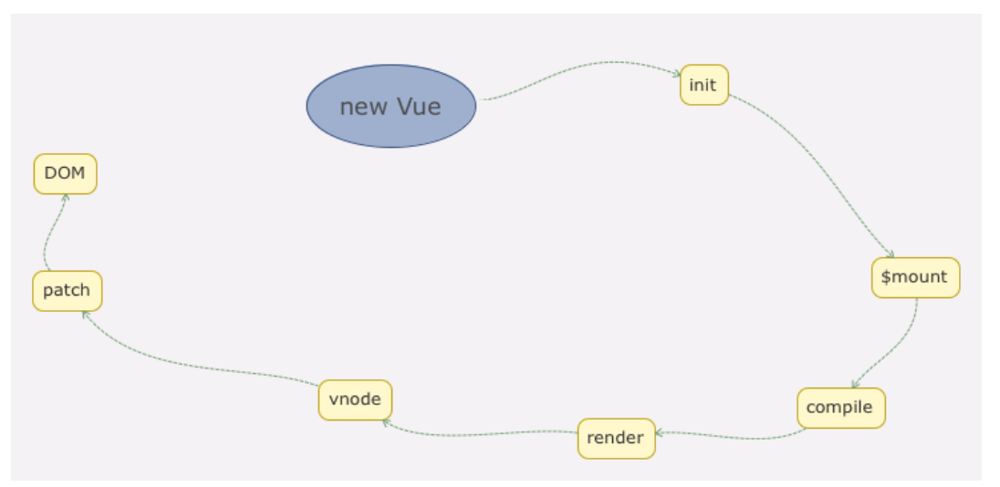

vue 数据解密：https://ustbhuangyi.github.io/vue-analysis/v2/data-driven/

# new Vue 发生了什么

```javascript
import { initMixin } from './init'
import { stateMixin } from './state'
import { renderMixin } from './render'
import { eventsMixin } from './events'
import { lifecycleMixin } from './lifecycle'
import { warn } from '../util/index'
import type { GlobalAPI } from 'types/global-api'

function Vue(options) {

  if (__DEV__ && !(this instanceof Vue)) {
    warn('Vue is a constructor and should be called with the `new` keyword')
  }
  this._init(options)
}

// @ts-expect-error Vue has function type

initMixin(Vue)
// @ts-expect-error Vue has function type

stateMixin(Vue)
// @ts-expect-error Vue has function type

eventsMixin(Vue)
// @ts-expect-error Vue has function type

lifecycleMixin(Vue)
// @ts-expect-error Vue has function type
renderMixin(Vue)

export default Vue as unknown as GlobalAPI

```

```javascript
export function initMixin(Vue: typeof Component) {
  Vue.prototype._init = function (options?: Record<string, any>) {
    const vm: Component = this // viewModel示例
    // a uid
    // 唯一 id
    vm._uid = uid++

    let startTag, endTag
    /* istanbul ignore if */
    if (__DEV__ && config.performance && mark) {
      startTag = `vue-perf-start:${vm._uid}`
      endTag = `vue-perf-end:${vm._uid}`
      mark(startTag)
    }

    // a flag to mark this as a Vue instance without having to do instanceof
    // 标记这是一个 Vue 实例，从而无需使用 instanceof 检查
    vm._isVue = true
    // avoid instances from being observed
    // 避免对实例本身进行响应式观察
    vm.__v_skip = true
    // effect scope
    // effect 作用域
    vm._scope = new EffectScope(true /* detached */)
    // #13134 edge case where a child component is manually created during the
    // render of a parent component
    // #13134 边界情况：在父组件渲染期间手动创建了子组件
    vm._scope.parent = undefined
    vm._scope._vm = true
    // merge options
    // 合并选项
    if (options && options._isComponent) {
      // optimize internal component instantiation
      // since dynamic options merging is pretty slow, and none of the
      // internal component options needs special treatment.
      // 优化内部组件实例化：动态合并选项较慢，内部组件选项无需特殊处理
      initInternalComponent(vm, options as any)
    } else {
      vm.$options = mergeOptions(
        resolveConstructorOptions(vm.constructor as any),
        options || {},
        vm
      )
    }
    /* istanbul ignore else */
    /* 忽略 Istanbul 覆盖率的 else 分支 */
    if (__DEV__) {
      initProxy(vm)
    } else {
      vm._renderProxy = vm
    }
    // expose real self
    // 暴露真实的自身引用
    vm._self = vm

    // 初始化生命周期
    initLifecycle(vm)
    // 初始化事件
    initEvents(vm)
    // 初始化渲染
    initRender(vm)
    callHook(vm, 'beforeCreate', undefined, false /* setContext */)
    initInjections(vm) // resolve injections before data/props
    initState(vm)
    initProvide(vm) // resolve provide after data/props
    callHook(vm, 'created')

    /* istanbul ignore if */
    if (__DEV__ && config.performance && mark) {
      vm._name = formatComponentName(vm, false)
      mark(endTag)
      measure(`vue ${vm._name} init`, startTag, endTag)
    }

    if (vm.$options.el) {
        // vue实例挂载
      vm.$mount(vm.$options.el)
    }
  }
}
```

Vue 初始化主要就干了几件事情，合并配置，初始化生命周期，初始化事件中心，初始化渲染，初始化 data、props、computed、watcher 等等。
Vue 的初始化逻辑写的非常清楚，把不同的功能逻辑拆成一些单独的函数执行，让主线逻辑一目了然，这样的编程思想是非常值得借鉴和学习的。
Vue 是通过构造函数通过在原型链上混入方法，将不同功能进行拆分。


vue 在 init 的时候，通过调用`vm.$mount(vm.$options.el)`对元素进行挂载，
因为 mount 函数会和当前所在的宿主环境相关，$mount 是在`platform/web/index`进行定义

```javascript
Vue.prototype.$mount = function (
  el?: string | Element,
  hydrating?: boolean
): Component {
  el = el && inBrowser ? query(el) : undefined;
  return mountComponent(this, el, hydrating);
};
```

`$mount`调用的是 mountComponent,mountComponent 的关键是创建了 updateComponent 方法， `vm._update(vm._render(), hydrating)`;其中调用了 `vm._render()`对元素进行 vnode tree 构建

```javascript
new Watcher(
  vm,
  updateComponent,
  noop,
  watcherOptions,
  true /* isRenderWatcher */
);
```

watch 中执行 this.getter 也就是 updateComponent 进行渲染，关键是`vm._render()`

`vm._render()`是在 renderMixin 进行定义的

```javascript
  Vue.prototype._render = function (): VNode {
    const vm: Component = this
    const { render, _parentVnode } = vm.$options
    if (_parentVnode && vm._isMounted) {
      vm.$scopedSlots = normalizeScopedSlots(
        vm.$parent!,
        _parentVnode.data!.scopedSlots,
        vm.$slots,
        vm.$scopedSlots
      )
      if (vm._slotsProxy) {
        syncSetupSlots(vm._slotsProxy, vm.$scopedSlots)
      }
    }

    // set parent vnode. this allows render functions to have access
    // 设置父 vnode，这允许 render 函数访问
    // to the data on the placeholder node.
    // 占位节点上的数据。
    vm.$vnode = _parentVnode!
    // render self
    // 渲染自身
    const prevInst = currentInstance
    const prevRenderInst = currentRenderingInstance
    let vnode
    try {
      setCurrentInstance(vm)
      currentRenderingInstance = vm
      vnode = render.call(vm._renderProxy, vm.$createElement)
    } catch (e: any) {
      handleError(e, vm, `render`)
      // return error render result,
      // 返回错误渲染结果，
      // or previous vnode to prevent render error causing blank component
      // 或返回之前的 vnode，以防渲染错误导致组件空白
      /* istanbul ignore else */
      // 忽略 Istanbul 覆盖率的 else 分支
      if (__DEV__ && vm.$options.renderError) {
        try {
          vnode = vm.$options.renderError.call(
            vm._renderProxy,
            vm.$createElement,
            e
          )
        } catch (e: any) {
          handleError(e, vm, `renderError`)
          vnode = vm._vnode
        }
      } else {
        vnode = vm._vnode
      }
    } finally {
      currentRenderingInstance = prevRenderInst
      setCurrentInstance(prevInst)
    }
    // if the returned array contains only a single node, allow it
    // 如果返回的数组只包含一个节点，则允许它
    if (isArray(vnode) && vnode.length === 1) {
      vnode = vnode[0]
    }
    // return empty vnode in case the render function errored out
    // 如果 render 函数出错，返回空的 vnode
    if (!(vnode instanceof VNode)) {
      if (__DEV__ && isArray(vnode)) {
        warn(
          'Multiple root nodes returned from render function. Render function ' +
            'should return a single root node.',
          vm
        )
      }
      vnode = createEmptyVNode()
    }
    // set parent
    // 设置父节点
    vnode.parent = _parentVnode
    console.log('render vnode:', vnode)
    return vnode
  }
```

`vnode = render.call(vm._renderProxy, vm.$createElement)`通过该方法生成 vnode，render 就是 vue 中的 render 方法，里面的 h 就是传入的 vm.$createElement 方法通过该方法构建出 vnode tree

```javascript
new Vue({
  el: "#app",
  data: {
    message: "Hello Vue!111",
  },
  render: function (h) {
    return h("div", { id: "app1" }, [
      h("span", {}, this.message),
      h(
        "button",
        {
          on: {
            click: () => {
              this.message += "!";
            },
          },
        },
        "点我"
      ),
      h("input", {
        domProps: {
          value: this.message,
        },
        on: {
          input: (event) => {
            this.message = event.target.value;
          },
        },
      }),
    ]);
  },
});
```

最终构建的 vnode tree 通过`vm._update(vm._render(), hydrating)` 传给了`vm._update` 方法

```javascript
Vue.prototype._update = function (vnode: VNode, hydrating?: boolean) {
  const vm: Component = this;
  const prevEl = vm.$el;
  const prevVnode = vm._vnode;
  const restoreActiveInstance = setActiveInstance(vm);
  vm._vnode = vnode;
  // Vue.prototype.__patch__ is injected in entry points
  // based on the rendering backend used.
  // Vue.prototype.__patch__ 在入口点被注入，基于所使用的渲染后端
  if (!prevVnode) {
    // initial render
    // 初始渲染
    vm.$el = vm.__patch__(vm.$el, vnode, hydrating, false /* removeOnly */);
  } else {
    // updates
    // 更新
    vm.$el = vm.__patch__(prevVnode, vnode);
  }
  restoreActiveInstance();
  // update __vue__ reference
  // 更新 DOM 元素上的 __vue__ 引用
  if (prevEl) {
    prevEl.__vue__ = null;
  }
  if (vm.$el) {
    vm.$el.__vue__ = vm;
  }
  // if parent is an HOC, update its $el as well
  // 如果父组件是 HOC（高阶组件），也要更新它的 $el
  let wrapper: Component | undefined = vm;
  while (
    wrapper &&
    wrapper.$vnode &&
    wrapper.$parent &&
    wrapper.$vnode === wrapper.$parent._vnode
  ) {
    wrapper.$parent.$el = wrapper.$el;
    wrapper = wrapper.$parent;
  }
  // updated hook is called by the scheduler to ensure that children are
  // updated in a parent's updated hook.
  // updated 钩子由调度器调用，以确保子组件在父组件的 updated 钩子中已更新。
};
```

其中的关键就是`vm.__patch__`将 vnode 彻底完成宿主环境中的展示 dom 进行挂载
`__patch__`和宿主环境相关，比如服务端环境，跨端环境等等被放在了 platform/web 中

挂载 patch 方法
`Vue.prototype.__patch__ = inBrowser ? patch : noop`

patch 方法
`export const patch: Function = createPatchFunction({ nodeOps, modules })`
nodeOps web 环境下节点的操作方法
createPatchFunction 利用函数柯里化对一些传参进行固定本质上 patch = return patch

```javascript
function patch(oldVnode, vnode, hydrating, removeOnly) {
  if (isUndef(vnode)) {
    if (isDef(oldVnode)) invokeDestroyHook(oldVnode);
    return;
  }

  let isInitialPatch = false;
  const insertedVnodeQueue: any[] = [];

  if (isUndef(oldVnode)) {
    // empty mount (likely as component), create new root element
    isInitialPatch = true;
    createElm(vnode, insertedVnodeQueue);
  } else {
    const isRealElement = isDef(oldVnode.nodeType);
    if (!isRealElement && sameVnode(oldVnode, vnode)) {
      // patch existing root node
      patchVnode(oldVnode, vnode, insertedVnodeQueue, null, null, removeOnly);
    } else {
      if (isRealElement) {
        // mounting to a real element
        // check if this is server-rendered content and if we can perform
        // a successful hydration.
        if (oldVnode.nodeType === 1 && oldVnode.hasAttribute(SSR_ATTR)) {
          oldVnode.removeAttribute(SSR_ATTR);
          hydrating = true;
        }
        if (isTrue(hydrating)) {
          if (hydrate(oldVnode, vnode, insertedVnodeQueue)) {
            invokeInsertHook(vnode, insertedVnodeQueue, true);
            return oldVnode;
          } else if (__DEV__) {
            warn(
              "The client-side rendered virtual DOM tree is not matching " +
                "server-rendered content. This is likely caused by incorrect " +
                "HTML markup, for example nesting block-level elements inside " +
                "<p>, or missing <tbody>. Bailing hydration and performing " +
                "full client-side render."
            );
          }
        }
        // either not server-rendered, or hydration failed.
        // create an empty node and replace it
        oldVnode = emptyNodeAt(oldVnode);
      }

      // replacing existing element
      const oldElm = oldVnode.elm;
      const parentElm = nodeOps.parentNode(oldElm);

      // create new node
      createElm(
        vnode,
        insertedVnodeQueue,
        // extremely rare edge case: do not insert if old element is in a
        // leaving transition. Only happens when combining transition +
        // keep-alive + HOCs. (#4590)
        oldElm._leaveCb ? null : parentElm,
        nodeOps.nextSibling(oldElm)
      );

      // update parent placeholder node element, recursively
      if (isDef(vnode.parent)) {
        let ancestor = vnode.parent;
        const patchable = isPatchable(vnode);
        while (ancestor) {
          for (let i = 0; i < cbs.destroy.length; ++i) {
            cbs.destroy[i](ancestor);
          }
          ancestor.elm = vnode.elm;
          if (patchable) {
            for (let i = 0; i < cbs.create.length; ++i) {
              cbs.create[i](emptyNode, ancestor);
            }
            // #6513
            // invoke insert hooks that may have been merged by create hooks.
            // e.g. for directives that uses the "inserted" hook.
            const insert = ancestor.data.hook.insert;
            if (insert.merged) {
              // start at index 1 to avoid re-invoking component mounted hook
              // clone insert hooks to avoid being mutated during iteration.
              // e.g. for customed directives under transition group.
              const cloned = insert.fns.slice(1);
              for (let i = 0; i < cloned.length; i++) {
                cloned[i]();
              }
            }
          } else {
            registerRef(ancestor);
          }
          ancestor = ancestor.parent;
        }
      }

      // destroy old node
      if (isDef(parentElm)) {
        removeVnodes([oldVnode], 0, 0);
      } else if (isDef(oldVnode.tag)) {
        invokeDestroyHook(oldVnode);
      }
    }
  }

  invokeInsertHook(vnode, insertedVnodeQueue, isInitialPatch);
  return vnode.elm;
}
```

patch 中`  oldVnode = emptyNodeAt(oldVnode);`将传入 oldVnode 转换为 vnode 对象再通过调用
createElm 的作用是通过虚拟节点创建真实的 DOM 并插入到它的父节点中。

```javascript
function createElm(
  vnode,
  insertedVnodeQueue,
  parentElm?: any,
  refElm?: any,
  nested?: any,
  ownerArray?: any,
  index?: any
) {
  if (isDef(vnode.elm) && isDef(ownerArray)) {
    // This vnode was used in a previous render!
    // now it's used as a new node, overwriting its elm would cause
    // potential patch errors down the road when it's used as an insertion
    // reference node. Instead, we clone the node on-demand before creating
    // associated DOM element for it.
    vnode = ownerArray[index] = cloneVNode(vnode);
  }

  vnode.isRootInsert = !nested; // for transition enter check
  if (createComponent(vnode, insertedVnodeQueue, parentElm, refElm)) {
    return;
  }

  const data = vnode.data;

  const children = vnode.children;

  const tag = vnode.tag;

  if (isDef(tag)) {
    if (__DEV__) {
      if (data && data.pre) {
        creatingElmInVPre++;
      }
      if (isUnknownElement(vnode, creatingElmInVPre)) {
        warn(
          "Unknown custom element: <" +
            tag +
            "> - did you " +
            "register the component correctly? For recursive components, " +
            'make sure to provide the "name" option.',
          vnode.context
        );
      }
    }

    vnode.elm = vnode.ns
      ? nodeOps.createElementNS(vnode.ns, tag)
      : nodeOps.createElement(tag, vnode);
    setScope(vnode);

    createChildren(vnode, children, insertedVnodeQueue);
    if (isDef(data)) {
      invokeCreateHooks(vnode, insertedVnodeQueue);
    }
    insert(parentElm, vnode.elm, refElm);

    if (__DEV__ && data && data.pre) {
      creatingElmInVPre--;
    }
  } else if (isTrue(vnode.isComment)) {
    vnode.elm = nodeOps.createComment(vnode.text);
    insert(parentElm, vnode.elm, refElm);
  } else {
    vnode.elm = nodeOps.createTextNode(vnode.text);
    insert(parentElm, vnode.elm, refElm);
  }
}
```

接下来调用 createChildren 方法去创建子元素：createChildren 的逻辑很简单，实际上是遍历子虚拟节点，递归调用 createElm,遍历过程中会把 vnode.elm 作为父容器的 DOM 节点占位符传入。
接着再调用 invokeCreateHooks 方法执行所有的 create 的钩子并把 vnode push 到 insertedVnodeQueue 中。`invokeInsertHook(vnode, insertedVnodeQueue, true);`

```javascript
function invokeCreateHooks(vnode, insertedVnodeQueue) {
  for (let i = 0; i < cbs.create.length; ++i) {
    cbs.create[i](emptyNode, vnode);
  }
  i = vnode.data.hook; // Reuse variable
  if (isDef(i)) {
    if (isDef(i.create)) i.create(emptyNode, vnode);
    if (isDef(i.insert)) insertedVnodeQueue.push(vnode);
  }
}
```

最终通过 insert 将元素挂载

```javascript
function insert(parent, elm, ref) {
  if (isDef(parent)) {
    if (isDef(ref)) {
      if (nodeOps.parentNode(ref) === parent) {
        nodeOps.insertBefore(parent, elm, ref);
      }
    } else {
      nodeOps.appendChild(parent, elm);
    }
  }
}
```
