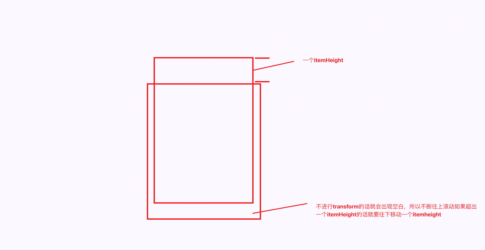
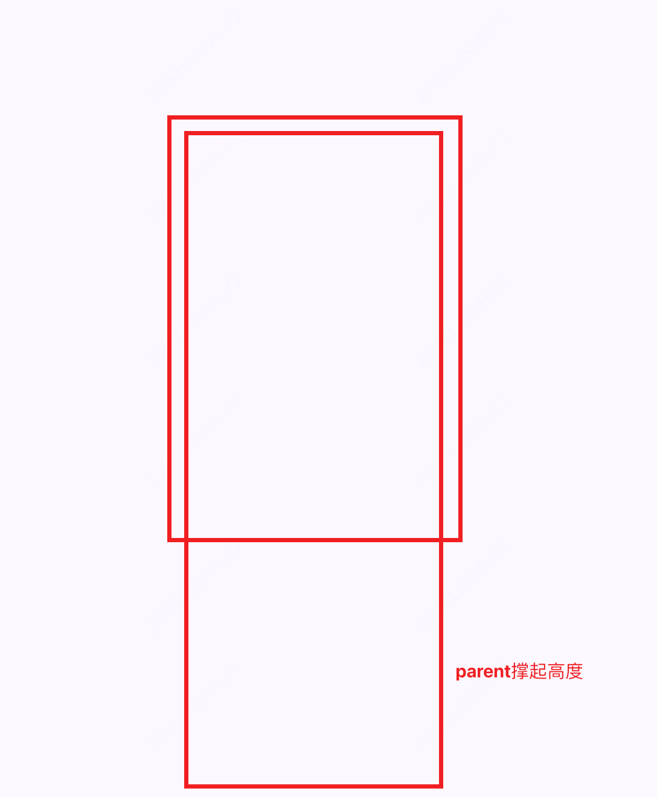

# 虚拟列表

## 虚拟列表（VirtualList）核心原理详解：

1. 只渲染可见区域的数据项，极大减少 DOM 数量，提升性能。
2. 用 .phantom 绝对定位元素撑起总高度，制造完整滚动条体验。
2. .real-list 绝对定位，通过 transform: translateY(offset) 精确移动到可见区顶部。
   - .real-list 的高度无需设置，内容高度由渲染的 item 数量自动撑开。
   - 为什么不设置 .real-list 高度？
       * 只要保证 .phantom 撑起滚动条，.real-list 只需渲染可见项并偏移到正确位置即可。
       * .real-list 的高度 = (end - start) * itemHeight，由渲染的 div 自动撑开。
       * 这样可以避免多余的空白区域，且滚动时始终只渲染需要的 DOM。
3. 滚动时根据 scrollTop 动态计算可见区的 start/end 索引，只渲染这部分数据。
4. overScan 预渲染缓冲区，避免滚动过快出现白屏。
    代码结构说明：
    - VirtualList 构造函数：
        * 自动获取容器高度（container.clientHeight），计算可见项数 visibleCount。
        * 创建 .phantom 元素，高度为 data.length * itemHeight，撑起滚动条。
        * 创建 .real-list 元素，实际渲染可见区的 item。
        * 绑定 scroll 事件，滚动时触发 render。
    - render 方法：
        * 计算当前滚动 scrollTop。
        * 计算可见区起止索引 start/end（含 overScan）。
        * 计算 .real-list 的 translateY 偏移量 offsetY = start * itemHeight。
        * 只渲染 start~end 区间的数据项。
    - getColor：
        * 为每个 item 缓存唯一随机色，保证滚动复用时颜色不变。

    这样实现后：
    - 页面上始终只有几十个 DOM 节点，哪怕数据有 10 万条。
    - 滚动条长度、滚动体验与原生长列表一致。
    - 性能极高，不卡顿。

## 代码演示
```html
<!DOCTYPE html>
<html lang="en">

<head>
    <meta charset="UTF-8">
    <meta name="viewport" content="width=device-width, initial-scale=1.0">
    <title>手搓虚拟列表</title>
    <style>
        body {
            margin: 0;
            padding: 0;
            background-color: #fff;
        }

        * {
            box-sizing: border-box;
        }

        #container {
            width: 100vw;
            height: 100vh;
            overflow-y: auto;
            position: relative;
        }

        .item {
            height: 50px;
            line-height: 50px;
            border-bottom: 1px solid #eee;
            box-sizing: border-box;
            text-align: center;
        }

        .phantom {
            width: 100%;
            position: absolute;
            left: 0;
            top: 0;
            z-index: 0;
        }

        .real-list {
            position: absolute;
            left: 0;
            top: 0;
            width: 100%;
            z-index: 1;
        }
    </style>
</head>

<body>
    <!--
        虚拟列表（VirtualList）核心原理详解：

        1. 只渲染可见区域的数据项，极大减少 DOM 数量，提升性能。
        2. 用 .phantom 绝对定位元素撑起总高度，制造完整滚动条体验。
        3. .real-list 绝对定位，通过 transform: translateY(offset) 精确移动到可见区顶部。
            - .real-list 的高度无需设置，内容高度由渲染的 item 数量自动撑开。
            - 为什么不设置 .real-list 高度？
                * 只要保证 .phantom 撑起滚动条，.real-list 只需渲染可见项并偏移到正确位置即可。
                * .real-list 的高度 = (end - start) * itemHeight，由渲染的 div 自动撑开。
                * 这样可以避免多余的空白区域，且滚动时始终只渲染需要的 DOM。
        4. 滚动时根据 scrollTop 动态计算可见区的 start/end 索引，只渲染这部分数据。
        5. overscan 预渲染缓冲区，避免滚动过快出现白屏。

        代码结构说明：
        - VirtualList 构造函数：
            * 自动获取容器高度（container.clientHeight），计算可见项数 visibleCount。
            * 创建 .phantom 元素，高度为 data.length * itemHeight，撑起滚动条。
            * 创建 .real-list 元素，实际渲染可见区的 item。
            * 绑定 scroll 事件，滚动时触发 render。
        - render 方法：
            * 计算当前滚动 scrollTop。
            * 计算可见区起止索引 start/end（含 overscan）。
            * 计算 .real-list 的 translateY 偏移量 offsetY = start * itemHeight。
            * 只渲染 start~end 区间的数据项。
        - getColor：
            * 为每个 item 缓存唯一随机色，保证滚动复用时颜色不变。

        这样实现后：
        - 页面上始终只有几十个 DOM 节点，哪怕数据有 10 万条。
        - 滚动条长度、滚动体验与原生长列表一致。
        - 性能极高，不卡顿。
        -->
    <div id="container"></div>
    <script>
        /**
         * 虚拟列表类，适用于大数据量高性能滚动渲染
         */
        class VirtualList {
            /**
             * @param {Object} options
             * @param {HTMLElement} options.container 容器元素
             * @param {Array} options.data 数据源数组
             * @param {number} options.itemHeight 单项高度（px）
             * @param {number} options.containerHeight 容器高度（px）
             * @param {function} options.renderItem 渲染单项函数 (item, index) => html字符串
             * @param {number} [options.overscan=5] 预渲染缓冲区（可见区上下多渲染几项，提升滚动体验）
             */
            constructor({ container, data, itemHeight, renderItem, overscan = 5 }) {
                this.container = container;
                this.data = data;
                this.itemHeight = itemHeight;
                this.renderItem = renderItem;
                this.overscan = overscan;

                // 自动获取容器高度
                this.containerHeight = container.clientHeight;
                // 计算可见区域最多能显示多少项
                this.visibleCount = Math.ceil(this.containerHeight / itemHeight);

                // 创建伪元素撑起总高度
                this.phantom = document.createElement('div');
                this.phantom.className = 'phantom';
                this.phantom.style.height = data.length * itemHeight + 'px';
                this.container.appendChild(this.phantom);

                // 真正渲染的列表区域
                this.realList = document.createElement('div');
                this.realList.className = 'real-list';
                this.container.appendChild(this.realList);

                // 绑定滚动事件
                this.container.addEventListener('scroll', this.handleScroll.bind(this));

                // 首次渲染
                this.render();
            }

            /**
             * 滚动事件处理，重新渲染可见区域
             */
            handleScroll() {
                // this.render();
                if (this.rafId) cancelAnimationFrame(this.rafId);
                this.rafId = requestAnimationFrame(() => {
                    this.render();
                    this.rafId = null;
                });
            }
            // 17 + 5 + 5 = 27
            /**
             * 渲染可见区域的列表项
             */
            render() {
                // 当前滚动距离
                const scrollTop = this.container.scrollTop;
                /*
                假设我们的visibleCount是10，预留的是5个，也就是实际渲染会渲染10+5*2 = 20个
                这个时候如果滚动高度超过5个，滚动其实就是展示visibleCount之外的列表，如果超过5个的高度（其实还预留了5个）
                那这个时候就要移动start之前是(0-19)展示20个列表，start=1就要展示(1,20)个。
                这个时候如果不操作realList的transform的话，这个时候整个realList就是移动到看不到的地方了
                */
                let start = Math.floor(scrollTop / this.itemHeight) - this.overscan;
                start = Math.max(0, start);
                // 计算可见区域结束索引
                let end = start + this.visibleCount + this.overscan * 2;
                end = Math.min(this.data.length, end);

                // 只有 start 或 end 发生变化时才更新 DOM
                if (this._lastStart === start && this._lastEnd === end) {
                    // 没有新元素进入视口，无需更新
                    return;
                }
                this._lastStart = start;
                this._lastEnd = end;

                // 计算真实列表的偏移量
                const offsetY = start * this.itemHeight;
                console.log('render', { scrollTop, start, end, offsetY });
                this.realList.style.transform = `translateY(${offsetY}px)`;
                // 渲染可见项
                let html = '';
                for (let i = start; i < end; i++) {
                    html += this.renderItem(this.data[i], i);
                }
                this.realList.innerHTML = html;
            }
        }

        // 示例数据
        const data = Array.from({ length: 100000 }, (_, i) => `第 ${i + 1} 项`);

        // 实例化虚拟列表
        new VirtualList({
            container: document.getElementById('container'),
            data,
            itemHeight: 50,
            renderItem: (item, idx) => `<div class="item" >${item}</div>`
        });
    </script>
</body>
```
## 关键逻辑图解

- 滚动方案


- parent撑起高度，模拟时间数量下的滚动
